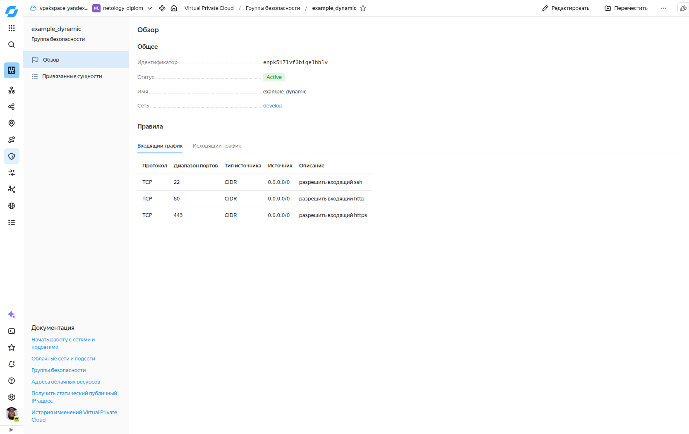
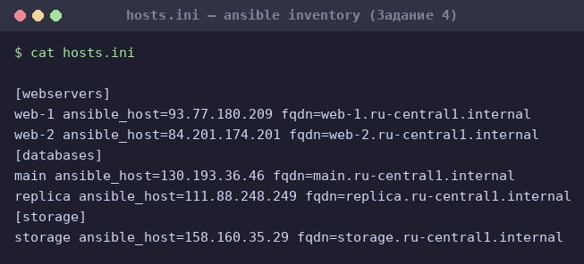
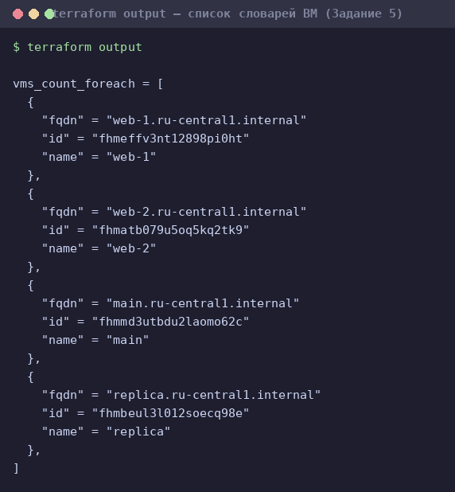
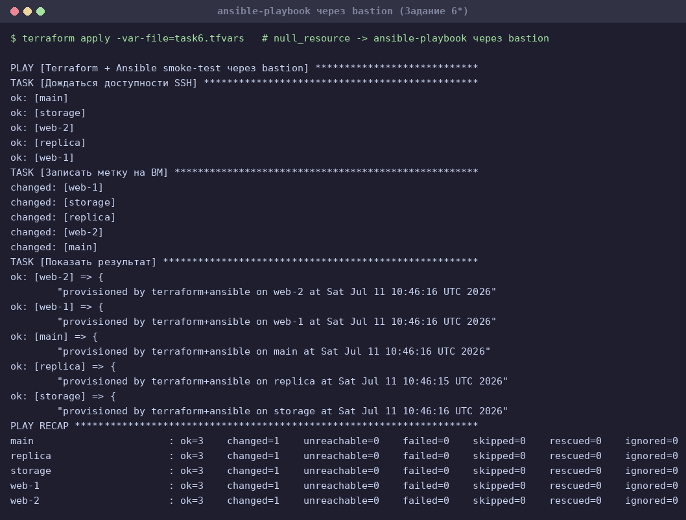

# Домашнее задание «Управляющие конструкции в коде Terraform»

Занятие 03 модуля «Облачная инфраструктура» (Yandex Cloud).
Отработка `count`, `for_each`, `dynamic`, функций `file`/`templatefile`/`coalesce`
и шаблонизатора (Interpolation Syntax).

- **Terraform:** v1.12.2 (`required_version = "~>1.12.0"`)
- **Провайдер:** `yandex-cloud/yandex` (+ `hashicorp/null`, `hashicorp/local`)
- **Аутентификация:** ключ сервисного аккаунта (`service_account_key_file`), файл вне репозитория
- **Все ВМ — прерываемые** (`scheduling_policy { preemptible = true }`)
- Хардкод-значений в ресурсах нет — всё вынесено в переменные/`locals`

## Структура проекта (`03/src`)

| Файл | Назначение |
|------|-----------|
| `providers.tf` | Провайдеры и аутентификация (SA-ключ) |
| `main.tf` | Сеть, подсеть, `data` образа Ubuntu |
| `security.tf` | Группа безопасности `example_dynamic` (Задание 1) |
| `variables.tf` | Переменные облака и правил SG |
| `variables-vm.tf` | Переменные ВМ и управляющие флаги |
| `locals.tf` | ssh-ключ через `file()` + общий `metadata` |
| `count-vm.tf` | web-1, web-2 через `count` (Задание 2.1) |
| `for_each-vm.tf` | main, replica через `for_each` (Задание 2.2) |
| `disk_vm.tf` | 3 диска + `storage` с `dynamic secondary_disk` (Задание 3) |
| `ansible.tf` | inventory через `templatefile` + `null_resource` (Задания 4, 6) |
| `hosts.tftpl` | Шаблон inventory (3 группы + bastion) |
| `outputs.tf` | Список словарей ВМ (Задание 5) |
| `bastion.tf` | Bastion-хост (Задание 6) |
| `test.yml`, `ansible.cfg` | Плейбук и конфиг ansible (Задание 6) |
| `task6.tfvars` | Переключатель для Задания 6 (`nat=false`, bastion, ansible) |

---

## Задание 1 — группа безопасности

Проект инициализирован и применён:

```bash
export TF_CLI_CONFIG_FILE="$PWD/.terraformrc"   # network mirror Yandex
terraform init
terraform apply
```

Группа безопасности `example_dynamic` создаётся динамическими блоками `ingress`/`egress`
(`security.tf`). Входящие правила (все `0.0.0.0/0`):

| Протокол | Порт | Описание |
|----------|------|----------|
| TCP | 22 | разрешить входящий ssh |
| TCP | 80 | разрешить входящий http |
| TCP | 443 | разрешить входящий https |

Скриншот входящих правил в ЛК Yandex Cloud:



---

## Задание 2 — count и for_each

### 2.1. web-1, web-2 через `count` (`count-vm.tf`)

```hcl
resource "yandex_compute_instance" "web" {
  count      = var.web_vm_count            # 2
  depends_on = [yandex_compute_instance.db] # 2.3: после баз данных

  name     = "web-${count.index + 1}"      # web-1, web-2 (не web-0/1)
  hostname = "web-${count.index + 1}"
  ...
  network_interface {
    subnet_id          = yandex_vpc_subnet.develop.id
    nat                = var.enable_nat
    security_group_ids = [yandex_vpc_security_group.example.id] # SG из Задания 1
  }
  metadata = local.vm_metadata
}
```

- Имена `web-1`, `web-2` формируются как `count.index + 1`.
- Назначена группа безопасности из Задания 1.

### 2.2. main, replica через `for_each` (`for_each-vm.tf`)

Общая переменная требуемого типа (`variables-vm.tf`):

```hcl
variable "each_vm" {
  type = list(object({
    vm_name     = string
    cpu         = number
    ram         = number
    disk_volume = number
  }))
  default = [
    { vm_name = "main",    cpu = 4, ram = 4, disk_volume = 15 },
    { vm_name = "replica", cpu = 2, ram = 2, disk_volume = 10 },
  ]
}
```

```hcl
resource "yandex_compute_instance" "db" {
  for_each = { for vm in var.each_vm : vm.vm_name => vm }  # list -> map

  name = each.value.vm_name                                # main / replica
  resources {
    cores  = each.value.cpu
    memory = each.value.ram
    ...
  }
  boot_disk { initialize_params { size = each.value.disk_volume ... } }
  ...
}
```

`main` и `replica` различаются по cpu/ram/disk_volume.

### 2.3. Порядок создания

В ресурсе `web` объявлен `depends_on = [yandex_compute_instance.db]` —
web-ВМ создаются **после** ВМ баз данных.

### 2.4. Публичный ключ через `file()` (`locals.tf`)

```hcl
locals {
  ssh_public_key = file(pathexpand(var.ssh_public_key_path))  # ~/.ssh/id_rsa.pub
  vm_metadata = {
    serial-port-enable = "1"
    ssh-keys           = "ubuntu:${local.ssh_public_key}"
  }
}
```

`local.vm_metadata` подставляется в `metadata` всех ВМ.

---

## Задание 3 — диски и dynamic secondary_disk (`disk_vm.tf`)

```hcl
# 3 одинаковых диска по 1 ГБ через count
resource "yandex_compute_disk" "storage" {
  count = var.storage_disk_count   # 3
  name  = "storage-disk-${count.index + 1}"
  size  = var.storage_disk_size    # 1 ГБ
  zone  = var.default_zone
  type  = "network-hdd"
}

# ОДИНОЧНАЯ ВМ storage (без count/for_each)
resource "yandex_compute_instance" "storage" {
  name = "storage"
  ...
  dynamic "secondary_disk" {
    for_each = yandex_compute_disk.storage
    content {
      disk_id = secondary_disk.value.id
    }
  }
  ...
}
```

Три диска подключаются к ВМ `storage` динамическим блоком `secondary_disk`.

---

## Задание 4 — динамический ansible inventory

`ansible.tf` генерирует inventory через `templatefile`, передавая 5 ВМ тремя группами:

```hcl
resource "local_file" "inventory" {
  content = templatefile("${path.module}/hosts.tftpl", {
    webservers = yandex_compute_instance.web
    databases  = values(yandex_compute_instance.db)
    storage    = [yandex_compute_instance.storage]
    bastion    = yandex_compute_instance.bastion
  })
  filename = "${path.module}/hosts.ini"
}
```

Шаблон `hosts.tftpl` динамический (обработает и 2, и 999 ВМ), содержит 3 группы и
переменную `fqdn`. `ansible_host` вычисляется через `coalesce(nat_ip, internal_ip)` —
внешний IP, а если его нет (Задание 6, `nat=false`) — внутренний.

Получившийся `hosts.ini`:

```ini
[webservers]
web-1 ansible_host=93.77.180.209 fqdn=web-1.ru-central1.internal
web-2 ansible_host=84.201.174.201 fqdn=web-2.ru-central1.internal
[databases]
main ansible_host=130.193.36.46 fqdn=main.ru-central1.internal
replica ansible_host=111.88.248.249 fqdn=replica.ru-central1.internal
[storage]
storage ansible_host=158.160.35.29 fqdn=storage.ru-central1.internal
```

FQDN получен из атрибута `.fqdn` (задан `hostname`, поэтому вид `<имя>.ru-central1.internal`).



---

## Задание 5* — output списком словарей (`outputs.tf`)

```hcl
output "vms_count_foreach" {
  value = concat(
    [for vm in yandex_compute_instance.web : { name = vm.name, id = vm.id, fqdn = vm.fqdn }],
    [for vm in yandex_compute_instance.db  : { name = vm.name, id = vm.id, fqdn = vm.fqdn }],
  )
}
```

Итерация по ресурсам `count` и `for_each` — без хардкода, любое число ВМ.

`terraform output`:

```
vms_count_foreach = [
  { "fqdn" = "web-1.ru-central1.internal"   "id" = "fhmeffv3nt12898pi0ht" "name" = "web-1" },
  { "fqdn" = "web-2.ru-central1.internal"   "id" = "fhmatb079u5oq5kq2tk9" "name" = "web-2" },
  { "fqdn" = "main.ru-central1.internal"    "id" = "fhmmd3utbdu2laomo62c" "name" = "main" },
  { "fqdn" = "replica.ru-central1.internal" "id" = "fhmbeul3l012soecq98e" "name" = "replica" },
]
```



---

## Задание 6* — ansible через null_resource + bastion

`null_resource.web_provision` (`ansible.tf`) через `local-exec` добавляет ключ в
`ssh-agent` и запускает `ansible-playbook` по сгенерированному inventory.

Шаблон `hosts.tftpl` доработан:
- `ansible_host` = внешний IP, а при его отсутствии (`nat=false`) — внутренний;
- при наличии bastion добавляются группа `[bastion]` и
  `ansible_ssh_common_args` c `ProxyCommand`.

Запуск варианта с bastion (целевые ВМ без внешнего IP):

```bash
terraform apply -var-file=task6.tfvars   # enable_nat=false, enable_bastion=true, web_provision=true
```

Инвентарь при этом (целевые ВМ — по внутренним IP, `[bastion]` + `ProxyCommand`):

```ini
[webservers]
web-1 ansible_host=10.0.1.36 fqdn=web-1.ru-central1.internal
web-2 ansible_host=10.0.1.21 fqdn=web-2.ru-central1.internal
[databases]
main ansible_host=10.0.1.17 fqdn=main.ru-central1.internal
replica ansible_host=10.0.1.26 fqdn=replica.ru-central1.internal
[storage]
storage ansible_host=10.0.1.4 fqdn=storage.ru-central1.internal
[bastion]
bastion ansible_host=93.77.176.62 fqdn=bastion.ru-central1.internal
[all:vars]
ansible_ssh_common_args='-o StrictHostKeyChecking=no -o ProxyCommand="ssh -W %h:%p -q -o StrictHostKeyChecking=no ubuntu@93.77.176.62"'
```

`ansible_host` берётся из `coalesce(nat_ip, internal_ip)`: при `nat=false` внешнего IP
нет, поэтому подставляется внутренний. Плейбук `test.yml` реально отработал на всех
5 ВМ через bastion (`PLAY RECAP`: `ok=3 changed=1 unreachable=0 failed=0`):



---

## Задание 7* — удаление 3-го элемента из local.vpc

Выражение (итерация по индексам, оставляем всё кроме индекса 2):

```hcl
merge(local.vpc, {
  subnet_ids   = [for i, v in local.vpc.subnet_ids : v if i != 2],
  subnet_zones = [for i, v in local.vpc.subnet_zones : v if i != 2],
})
```

Проверка в `terraform console` (данные из условия задания):

```
{
  "network_id" = "enp7i560tb28nageq0cc"
  "subnet_ids" = [
    "e9b0le401619ngf4h68n",
    "e2lbar6u8b2ftd7f5hia",
    "fl8ner8rjsio6rcpcf0h",
  ]
  "subnet_zones" = [
    "ru-central1-a",
    "ru-central1-b",
    "ru-central1-d",
  ]
}
```

Третий элемент (`b0ca48...` / `ru-central1-c`) удалён из обоих списков.
Альтернатива: `concat(slice(list, 0, 2), slice(list, 3, length(list)))`.

---

## Задание 8* — ошибка в tpl-шаблоне

Исходный шаблон (из условия):

```tftpl
${i["name"]} ansible_host=${i["network_interface"][0]["nat_ip_address"] platform_id=${i["platform_id "]}}
```

Terraform указывает точную позицию:

```
broken.tftpl:3,85-86: Invalid character; This character is not used within the
language., and 1 other diagnostic(s).
```

Две ошибки:
1. Интерполяция `${... nat_ip_address"]` **не закрыта** `}` перед `platform_id`
   (и в конце строки лишняя `}`).
2. В ключе `"platform_id "` — **лишний пробел**.

Исправленная строка:

```tftpl
${i["name"]} ansible_host=${i["network_interface"][0]["nat_ip_address"]} platform_id=${i["platform_id"]}
```

Проверка `terraform console` (рендер исправленного шаблона):

```
web-1 ansible_host=1.2.3.4 platform_id=standard-v3
```

---

## Задание 9* — генерация списков

**9.1. `rc01`…`rc99`:**

```hcl
[for i in range(1, 100) : format("rc%02d", i)]
```

**9.2. `rc01`…`rc96`, без оканчивающихся на 0/7/8/9 (кроме `rc19`):**

```hcl
[for i in range(1, 97) : format("rc%02d", i) if !contains([0, 7, 8, 9], i % 10) || i == 19]
```

Результат: `rc01…rc06, rc11…rc16, rc19, rc21…rc26, … rc91…rc96` (проверено в `terraform console`).

---

## Как запустить

```bash
cd 03/src
cp personal.auto.tfvars_example personal.auto.tfvars   # вписать cloud_id/folder_id
# ssh-ключ: ~/.ssh/id_rsa.pub (создать при отсутствии: ssh-keygen -t rsa)
export TF_CLI_CONFIG_FILE="$PWD/.terraformrc"
terraform init
terraform apply                       # основной прогон (Задания 1–5)
terraform apply -var-file=task6.tfvars  # вариант с bastion + ansible (Задание 6)
```

## Удаление ресурсов

```bash
terraform destroy
```

Все созданные ресурсы удаляются после сдачи (см. чек-лист).
