# Домашнее задание «Продвинутые методы работы с Terraform» (занятие 04)

Ветка **`terraform-04`**. Выполнены все задания: обязательные **1–3** и все звёздочки **4–8**.

## Структура

| Каталог | Задания | Что внутри |
|---|---|---|
| [`04/src`](src) (+ модуль [`src/vpc`](src/vpc)) | 1, 2, 3, 4 | 2 ВМ через remote-модуль, локальный vpc-модуль, state-операции, multi-subnet |
| [`04/mysql`](mysql) (+ 2 модуля) | 5 | Managed MySQL: модули кластера и БД/пользователя |
| [`04/s3`](s3) | 6 | S3-бакет через готовый модуль `terraform-yc-s3` |
| [`04/vault`](vault) | 7 | Vault в docker-compose + чтение/запись секретов |
| [`04/remote-state`](remote-state) | 8 | Разделение root на два (`vpc` + `vm`) через `terraform_remote_state` |

## Окружение

- **Terraform v1.12.2** (`required_version = "~>1.12.0"`)
- Провайдеры из зеркала `terraform-mirror.yandexcloud.net` (`.terraformrc` в каждом каталоге, init через `TF_CLI_CONFIG_FILE`): `yandex-cloud/yandex v0.215.0`, `hashicorp/template 2.2.0`, `hashicorp/vault`, `hashicorp/aws`, `hashicorp/random`
- Аутентификация — **ключ сервисного аккаунта** `~/.authorized_key.json` (в `.gitignore`), без OAuth-токена
- Каталог `netology-diplom` (`b1gabvo7h0vqf8vkt52s`)
- Все ВМ **preemptible** (прерываемые), класс `standard-v1`, 2 vCPU / 5% / 1 ГБ — минимум для экономии
- Секреты (`cloud_id`, `folder_id`, `public_key`, пароли) — в `personal.auto.tfvars` (в `.gitignore`), рядом лежат `*_example`
- Хардкода нет: образ через `image_family`, ssh-ключ через переменную, ID — из tfvars

---

## Задание 1 — два вызова remote-модуля, cloud-init с nginx и ssh-ключом

Код: [`src/main.tf`](src/main.tf), [`src/cloud-init.yml`](src/cloud-init.yml).

- **Две ВМ разных проектов** — два вызова remote-модуля `git::https://github.com/udjin10/yandex_compute_instance.git?ref=main`: `module "marketing_vm"` и `module "analytics_vm"`.
- **Принадлежность к проектам — через `labels`**: `labels = { owner = "vpakspace", project = "marketing" }` и `project = "analytics"`.
- **ssh-ключ — через переменную, без хардкода**: ключ передаётся в `data "template_file" "cloudinit"` в блоке `vars = { ssh_key = var.public_key }`, а в `cloud-init.yml` подставляется **элементом списка** `ssh_authorized_keys` (`- ${ssh_key}`), т.к. `ssh-authorized-keys` принимает список, а не строку.
- **nginx устанавливается через cloud-init** (`packages: [nginx]` + `runcmd`).

```hcl
data "template_file" "cloudinit" {
  template = file("${path.module}/cloud-init.yml")
  vars     = { ssh_key = var.public_key }
}

module "marketing_vm" {
  source     = "git::https://github.com/udjin10/yandex_compute_instance.git?ref=main"
  env_name   = "marketing"
  labels     = { owner = "vpakspace", project = "marketing" }
  metadata   = { user-data = data.template_file.cloudinit.rendered, serial-port-enable = "1" }
  # ...subnet из vpc-модуля, preemptible = true
}
```

**Подключение к консоли ВМ и `sudo nginx -t`** (nginx поставлен cloud-init'ом, ssh-ключ из template_file сработал — SSH пускает):

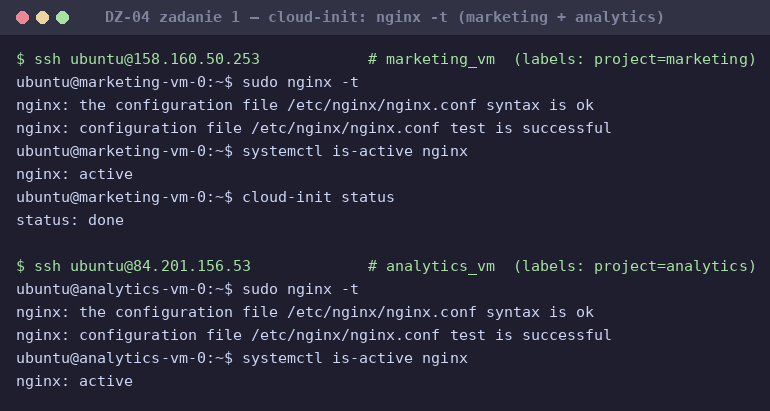

**`terraform console` — содержимое модулей** (`> module.marketing_vm.*` и `analytics_vm.*` — метки проектов, внешние IP, fqdn):

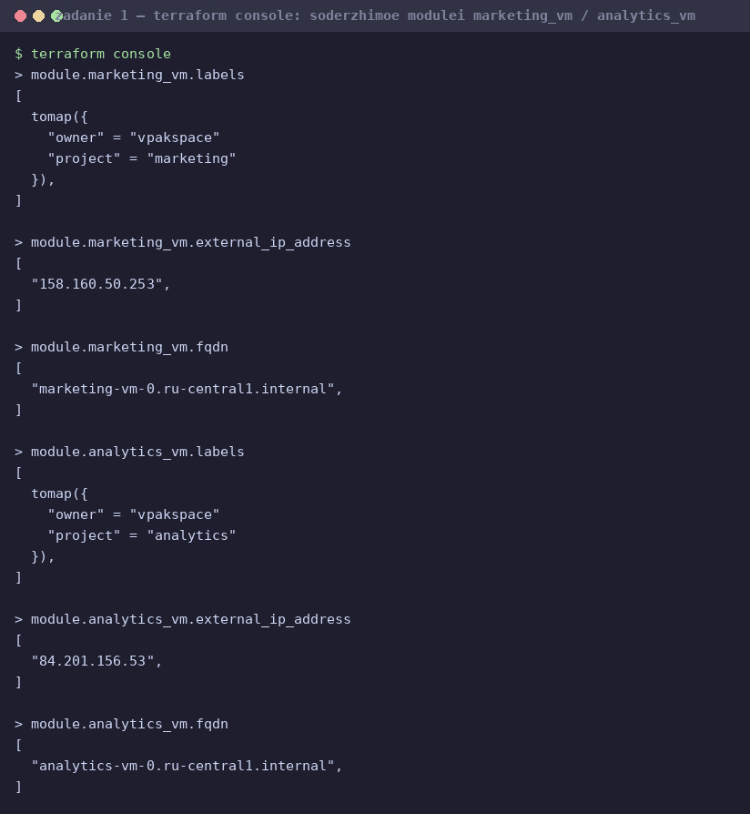

**Консоль Yandex Cloud — обе ВМ с колонкой «Метки»:**

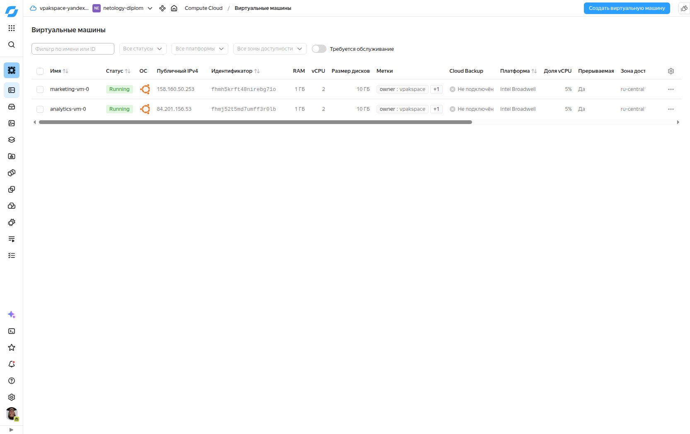

**Страница ВМ в YC — метки `owner : vpakspace`, `project : marketing`** (плюс preemptible, Ubuntu 20.04):

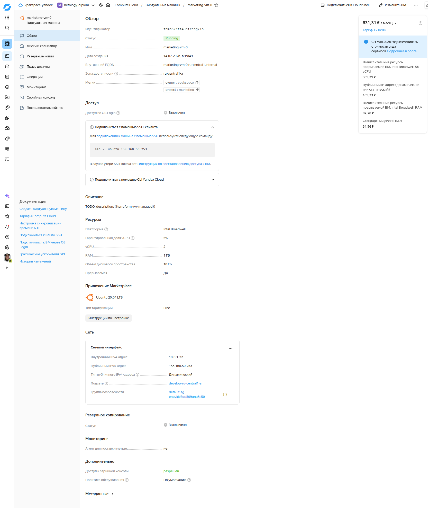

---

## Задание 2 — локальный модуль vpc

Код: [`src/vpc/`](src/vpc), вызов в [`src/main.tf`](src/main.tf), документация — [`src/vpc/README.md`](src/vpc/README.md).

- Модуль создаёт **одну сеть и одну подсеть** в зоне, переданной при вызове (`zone` + `cidr`).
- В модуль передаются: имя сети (`env_name`), `zone`, `cidr`.
- Модуль **возвращает информацию о `yandex_vpc_subnet`** через `output "subnets"` (+ `network_id`, `subnet_ids`, `subnet_zones` для передачи в модуль ВМ).
- Ресурсы `yandex_vpc_network` и `yandex_vpc_subnet` в root **заменены вызовом модуля**; `subnet_id` передаётся в модули ВМ.
- Документация сгенерирована **terraform-docs** (`terraform-docs markdown table ./vpc`).

```hcl
module "vpc" {
  source   = "./vpc"
  env_name = var.vpc_name      # develop
  zone     = var.default_zone  # ru-central1-a
  cidr     = var.default_cidr  # 10.0.1.0/24
}
```

**`terraform console > module.vpc`** — содержимое модуля (outputs с информацией о подсети):

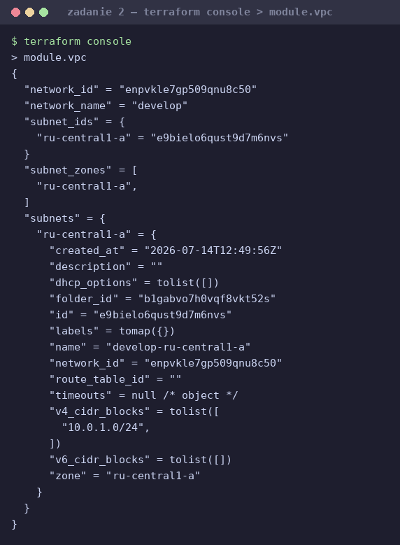

---

## Задание 3 — операции со state

Код-инфраструктура — та же (`04/src`). Последовательность команд:

```bash
# 1. список ресурсов в state
terraform state list

# 2. полностью удаляем из state модуль vpc (сеть + подсеть)
terraform state rm module.vpc

# 3. полностью удаляем из state модуль vm (marketing_vm)
terraform state rm module.marketing_vm

# 4. импортируем всё обратно
terraform import 'module.vpc.yandex_vpc_network.this'                    <network_id>
terraform import 'module.vpc.yandex_vpc_subnet.this["ru-central1-a"]'    <subnet_id>
terraform import 'module.marketing_vm.yandex_compute_instance.vm[0]'     <vm_id>

# 5. проверяем план — значимых изменений нет
terraform plan
```

После импорта `terraform plan` показал единственное изменение — `~ allow_stopping_for_update` (meta-аргумент Terraform, который `import` не заполняет; **реальную инфраструктуру он не меняет**, поэтому значимых изменений нет). После его применения повторный `plan` → **`No changes. Your infrastructure matches the configuration.`**

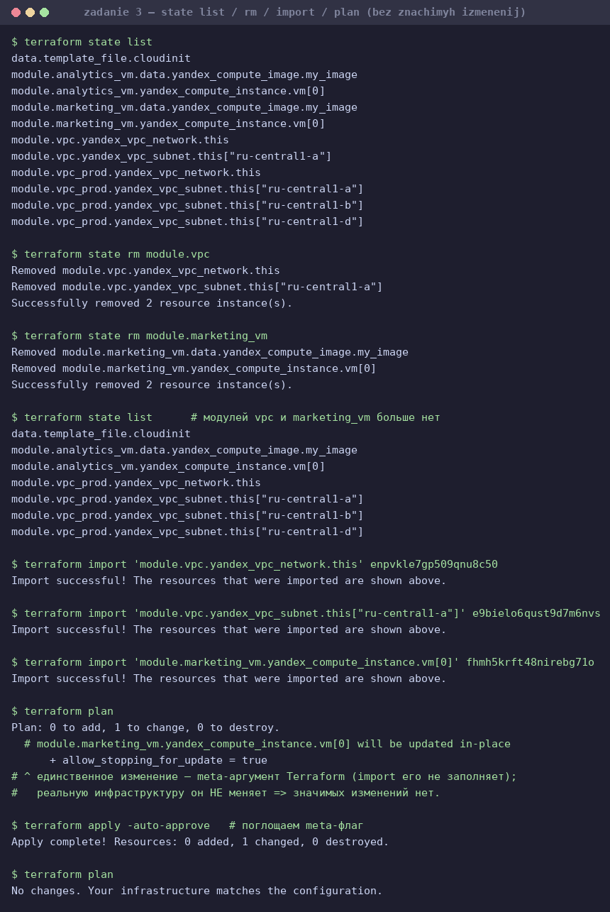

---

## Задание 4* — vpc-модуль с подсетями во всех зонах (list(object))

Код: [`src/vpc/`](src/vpc) (доработан), вызов `module "vpc_prod"` в [`src/main.tf`](src/main.tf).

Модуль доработан так, чтобы принимать переменную типа `list(object({ zone, cidr }))` и создавать подсеть в каждой зоне через `for_each`. При этом сохранён и интерфейс задания 2 (скалярные `zone`+`cidr`) — если `subnets` не задан, собирается одна подсеть:

```hcl
locals {
  subnets = var.subnets != null ? var.subnets : [{ zone = var.zone, cidr = var.cidr }]
}
resource "yandex_vpc_subnet" "this" {
  for_each       = { for s in local.subnets : s.zone => s }
  zone           = each.value.zone
  v4_cidr_blocks = [each.value.cidr]
  # ...
}
```

Вызов с несколькими подсетями (в примере задания зоны `a/b/c`, но `ru-central1-c` в YC выведена из эксплуатации — использованы актуальные **a/b/d**):

```hcl
module "vpc_prod" {
  source   = "./vpc"
  env_name = "production"
  subnets = [
    { zone = "ru-central1-a", cidr = "10.10.1.0/24" },
    { zone = "ru-central1-b", cidr = "10.10.2.0/24" },
    { zone = "ru-central1-d", cidr = "10.10.3.0/24" },
  ]
}
```

**План:** `terraform plan` → `Plan: 8 to add` (2 сети + 4 подсети + 2 ВМ), из них подсети `develop-ru-central1-a` (задание 2) и `production-ru-central1-a/b/d` (задание 4).

**Результат в консоли YC** — develop-подсеть + 3 подсети production:

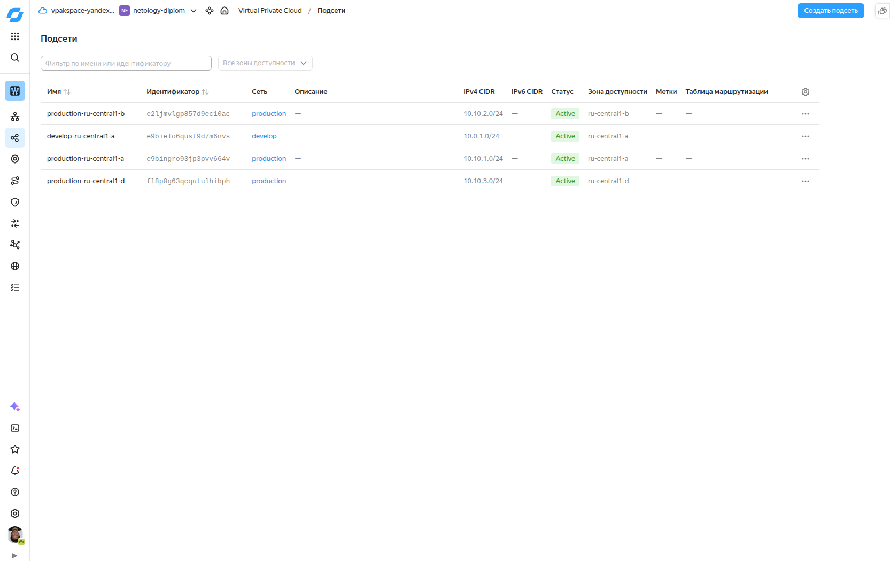

---

## Задание 5* — модули Managed MySQL

Код: [`mysql/`](mysql) — root-модуль и два вложенных модуля [`mysql-cluster`](mysql/modules/mysql-cluster) и [`mysql-database`](mysql/modules/mysql-database).

- **Модуль `mysql-cluster`** создаёт `yandex_mdb_mysql_cluster` с **одним или двумя хостами** в зависимости от `var.ha` (`ha=true` → 2, `ha=false` → 1); число хостов — через `dynamic "host"` по срезу зон. Передаются имя кластера и id сети.
- **Модуль `mysql-database`** создаёт `yandex_mdb_mysql_database` и `yandex_mdb_mysql_user` в уже существующем кластере (передаются имя БД, имя пользователя, id кластера).
- Сеть/подсети — из того же локального `vpc`-модуля (`../src/vpc`); класс хостов — минимальный burstable `b1.medium`, окружение `PRESTABLE` (для экономии).

Сценарий задания 5.3:

```bash
# 1) кластер example из ОДНОГО хоста (var.ha=false) + БД test + пользователь app
terraform apply -auto-approve
#    host_count = 1, database = { name = test, user = app }

# 2) меняем переменную ha=false -> ha=true: single-host превращается в кластер из 2 серверов
terraform apply -auto-approve -var="ha=true"
#    host_count = 2  (MASTER в ru-central1-a + REPLICA в ru-central1-b, оба ALIVE)
```

Кластер `example` — ALIVE/RUNNING; БД `test` и пользователь `app` (`test = ALL_PRIVILEGES`) сохранились при масштабировании.

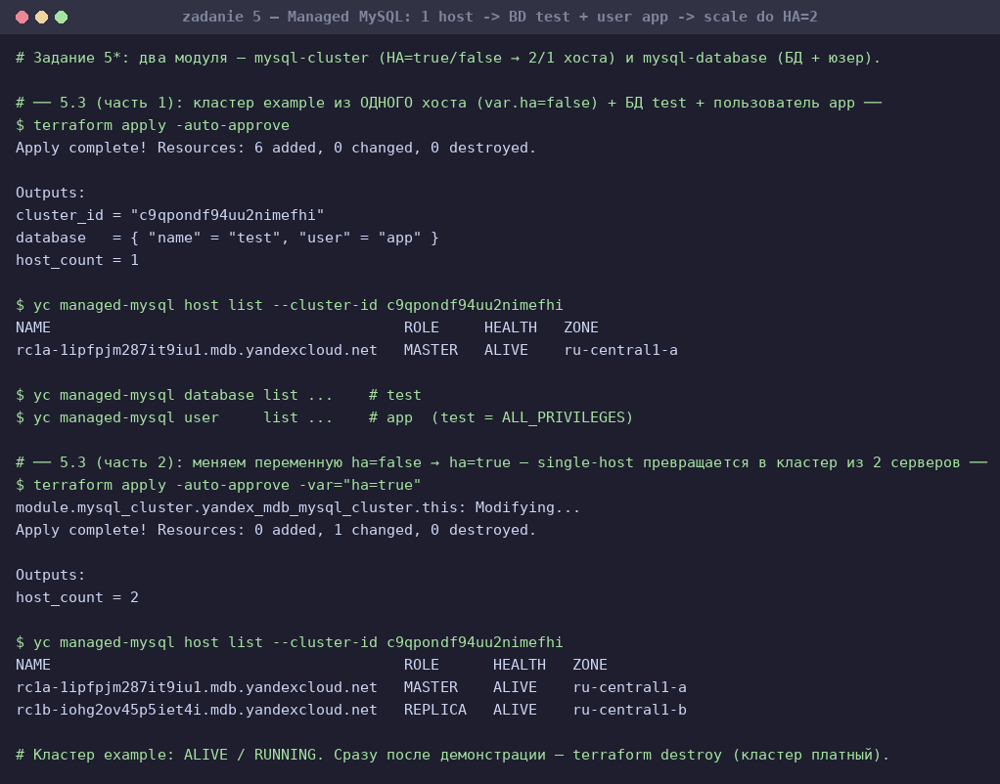

> Кластер удалён сразу после демонстрации (`terraform destroy`, 6 ресурсов) — managed MySQL платный.

---

## Задание 6* — S3-бакет через готовый модуль

Код: [`s3/`](s3).

Использован готовый модуль **[terraform-yc-modules/terraform-yc-s3](https://github.com/terraform-yc-modules/terraform-yc-s3)** (по образцу `examples/simple-bucket`). Бакет создаётся **по IAM-токену провайдера** (SA `terraform`, роль `editor`) — без статического ключа. Размер ограничен **1 ГБ** через `max_size`:

```hcl
module "s3" {
  source      = "github.com/terraform-yc-modules/terraform-yc-s3"
  bucket_name = "netology-tf-04-${random_string.unique_id.result}"
  max_size    = 1073741824  # 1 * 1024^3 = 1 ГБ
}
```

Бакет **`netology-tf-04-9ruqpkzq`** создан, `max_size = 1073741824` (1 ГБ). **Не удаляется** — пригодится для ДЗ к лекции 5.

> Примечание: `versioning`/`ACL`/`policy` требуют S3 API со статическим ключом и ролью `storage.admin`; для минимального бесплатного бакета они не нужны и убраны.

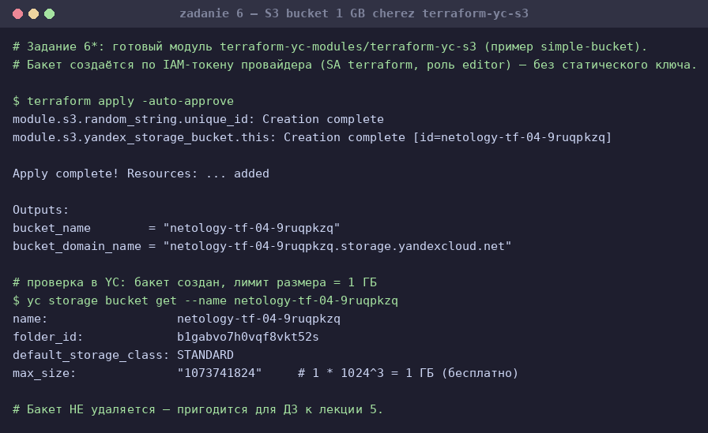
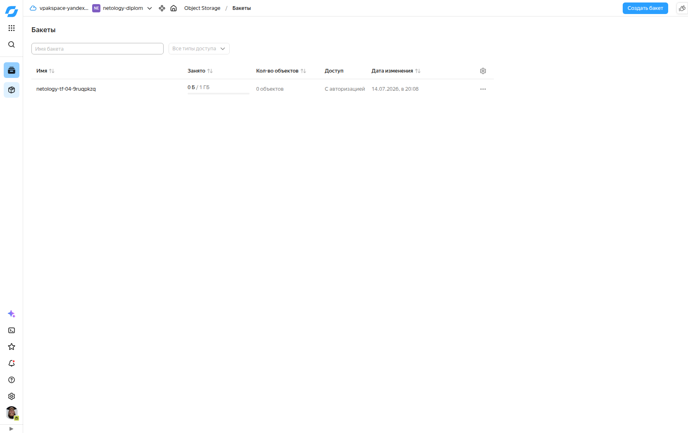

---

## Задание 7* — Vault в docker-compose

Код: [`vault/`](vault) ([`docker-compose.yml`](vault/docker-compose.yml), [`main.tf`](vault/main.tf)).

- Vault поднят через `docker compose up -d` (dev-режим, токен `education`).
- Движок `secret/` переведён в **KV v1** (dev-режим по умолчанию монтирует KV v2, с которым у `vault_generic_secret` путь был бы `secret/data/example` и значение в `.data.data`). С KV v1 путь и `.data` совпадают с примером задания.
- Создан секрет `secret/example` (`test = congrats!`) — в web-UI по пути `secrets/secret/create`, здесь для воспроизводимости через CLI.
- Terraform **читает** секрет и выводит в output; **бонус (7.5)** — записывает новый секрет `secret/terraform`.

```hcl
data "vault_generic_secret" "vault_example" { path = "secret/example" }

output "vault_example"      { value = nonsensitive(data.vault_generic_secret.vault_example.data) }
output "vault_example_test" { value = nonsensitive(data.vault_generic_secret.vault_example.data.test) }

resource "vault_generic_secret" "tf_example" {          # задание 7.5
  path      = "secret/terraform"
  data_json = jsonencode({ test = "written-by-terraform" })
}
```

Результат: `vault_example_test = "congrats!"`, а записанный terraform секрет `secret/terraform` содержит `test = written-by-terraform`.

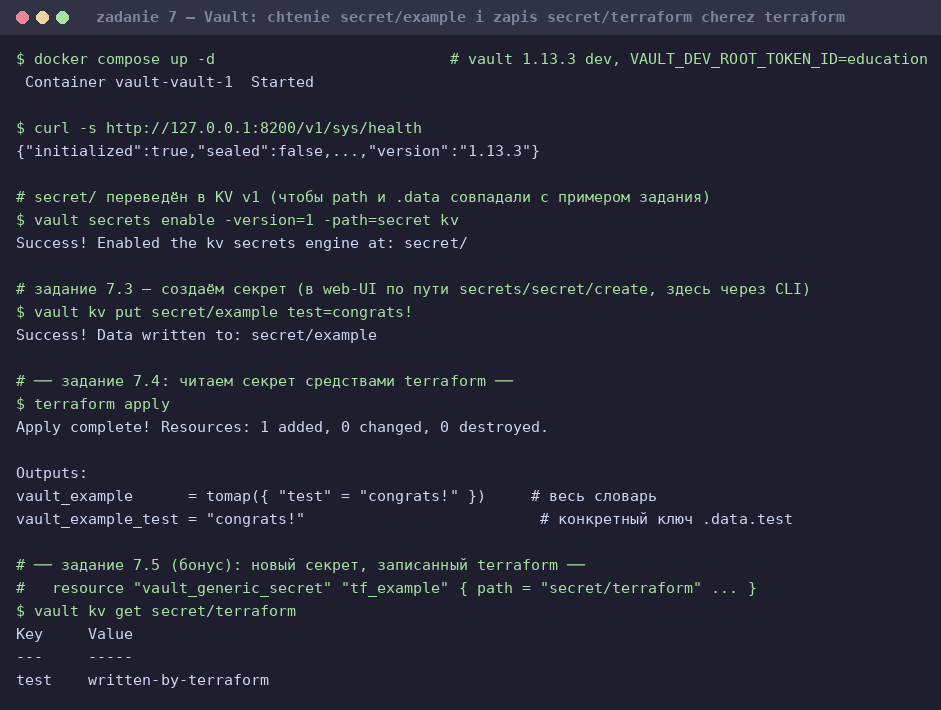

---

## Задание 8* — разделение root на два через remote state

Код: [`remote-state/vpc`](remote-state/vpc) и [`remote-state/vm`](remote-state/vm).

Root-модуль разделён на два независимых с отдельным состоянием:
- **`remote-state/vpc`** — создаёт сеть и подсеть, отдаёт `network_id`/`subnet_ids`/`subnet_zones` через `output`.
- **`remote-state/vm`** — читает состояние соседнего модуля через `data "terraform_remote_state"` и создаёт ВМ в этой сети.

```hcl
# remote-state/vm/remote_state.tf
data "terraform_remote_state" "vpc" {
  backend = "local"
  config  = { path = "../vpc/terraform.tfstate" }
}
# network_id = data.terraform_remote_state.vpc.outputs.network_id
```

`used_network_id` во втором модуле совпал с `network_id` первого (`enp0llq3vepkati21m9f`) — сеть прочитана из remote state. Применяется по очереди: сначала `apply` в `vpc`, затем в `vm`.

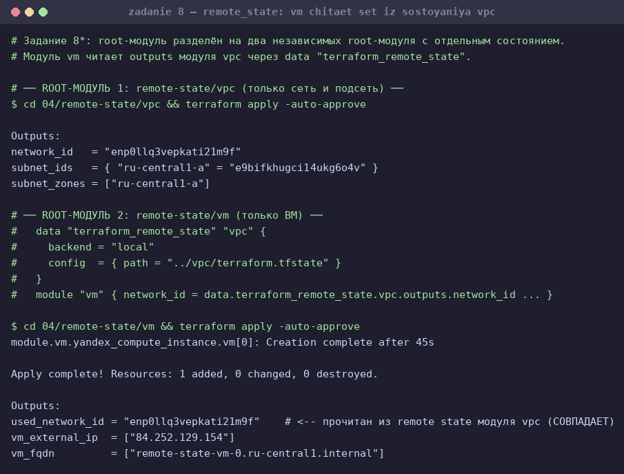

---

## Очистка

Все облачные ресурсы удалены (`terraform destroy`), **кроме S3-бакета** (нужен для ДЗ к лекции 5). Vault — локальный контейнер, останавливается `docker compose down`.
