# Домашнее задание «Использование Terraform в команде» (занятие 05)

Ветка **`terraform-05`**. Выполнены все задания: обязательные **0–4** и все звёздочки **5–7**.

## Структура

| Каталог | Задания | Что внутри |
|---|---|---|
| [`05/task1`](task1) | 1 | Код Нетологии (`04/src` + `04/demonstration1`) — объект проверки линтерами, плюс [отчёты](task1/reports) |
| [`05/src`](src) (+ модуль [`src/vpc`](src/vpc)) | 2, 3 | Код ДЗ-4 (2 ВМ, vpc-модуль) + backend `s3` со встроенными блокировками |
| [`05/validation`](validation) | 4, 5* | Переменные с блоками `validation` |
| [`05/backend-infra`](backend-infra) | 7* | Bootstrap-модуль: бакет под tfstate + сервисные аккаунты + статический ключ |
| [`.github/workflows/terraform-05.yml`](../.github/workflows/terraform-05.yml) | 6* | CI/CD: линтеры + `init`/`apply`/`destroy` |

## Окружение

- **Terraform v1.12.2** (`required_version = "~>1.12.0"`)
- **tflint v0.63.1** (+ `ruleset.terraform` 0.15.0-bundled), **checkov 3.3.8**
- Провайдеры: `yandex-cloud/yandex v0.217.0`, `hashicorp/template 2.2.0`, `random`, `time`
- Каталог `netology-diplom` (`b1gabvo7h0vqf8vkt52s`), все ВМ **preemptible** (прерываемые)
- Аутентификация — **ключ сервисного аккаунта**, путь передаётся переменной `sa_key_file`
- Секреты (`cloud_id`, `folder_id`, `public_key`) — в `personal.auto.tfvars` (в `.gitignore`), рядом лежат `*_example`; в CI те же значения приходят из GitHub Secrets

---

## Задание 0 — статья «Не привет»

Прочитано: <https://neprivet.com/>.

Суть: сообщение «Привет», отправленное без вопроса, ничего не сообщает — собеседник видит
уведомление, но не может ни ответить, ни начать думать над задачей, пока автор набирает
продолжение. Полезное действие такого сообщения нулевое, а издержки реальные: пока автор
печатает, получатель ждёт, и переписка растягивается на паузы вместо того, чтобы идти
асинхронно. Правильно — здороваться и сразу излагать суть **одним** сообщением: «Привет!
Делаю X, получаю Y, ожидал Z — не подскажешь, куда смотреть?». Тогда коллега отвечает при
первом же взгляде на чат, даже если он был занят или отошёл.

Идея передана коллегам — тот же принцип действует и в рабочих чатах, и в issue/PR:
контекст сразу, а не после рукопожатия.

---

## Задание 1 — проверка кода tflint и checkov

Проверялся код Нетологии — [`04/src`](https://github.com/netology-code/ter-homeworks/tree/main/04/src)
и [`04/demonstration1`](https://github.com/netology-code/ter-homeworks/tree/main/04/demonstration1),
скопированный как есть в [`05/task1`](task1). Проект **не инициализировался** (как и требует
задание): оба линтера анализируют HCL статически.

```bash
cd 05/task1
tflint --recursive --format compact     # 10 issue(s) found
checkov -d . --compact --quiet          # Failed checks: 4
```

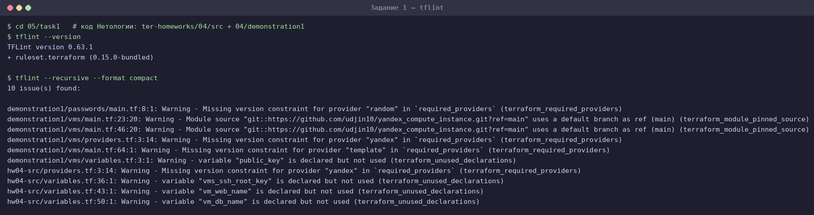

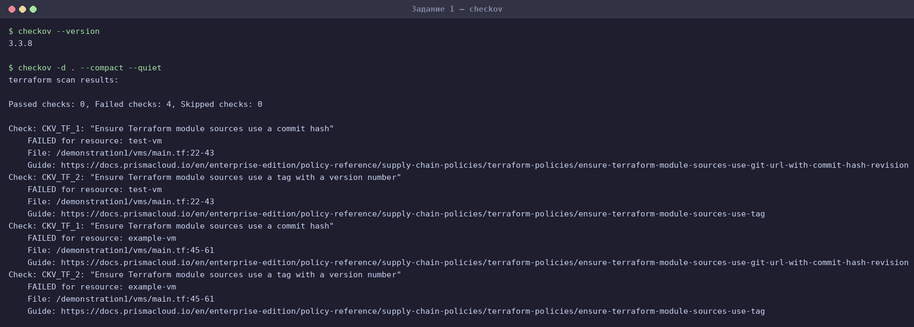

### Типы обнаруженных ошибок (без дублей)

Всего **14 срабатываний**, которые сводятся к **5 типам** — трём у tflint и двум у checkov:

| # | Тип (правило) | Инструмент | Срабатываний | Суть проблемы |
|---|---|---|---|---|
| 1 | `terraform_required_providers` | tflint | 4 | У провайдера не задан version constraint. Провайдер приедет любой версии, вплоть до мажорной с ломающими изменениями, — сборка перестаёт быть воспроизводимой. Сработало на `yandex` (дважды), `template` и `random`; у двух последних вообще нет блока `required_providers` — они выведены неявно из `data "template_file"` и `resource "random_password"`. |
| 2 | `terraform_unused_declarations` | tflint | 4 | Переменная объявлена, но нигде не используется: `vms_ssh_root_key`, `vm_web_name`, `vm_db_name` в `hw04-src/variables.tf`, `public_key` в `demonstration1/vms/variables.tf`. Мёртвый код: читающий ищет, где значение применяется, и не находит. |
| 3 | `terraform_module_pinned_source` | tflint | 2 | Источник модуля закреплён за веткой по умолчанию: `git::https://github.com/udjin10/yandex_compute_instance.git?ref=main`. Ветка движется, поэтому один и тот же код завтра развернёт другую инфраструктуру. |
| 4 | `CKV_TF_1` | checkov | 2 | «Ensure Terraform module sources use a commit hash» — та же проблема с другой стороны: checkov требует, чтобы модуль был закреплён неизменяемой ссылкой, то есть коммит-хешем. |
| 5 | `CKV_TF_2` | checkov | 2 | «Ensure Terraform module sources use a tag with a version number» — требование версионировать внешний модуль тегом, а не ссылаться на подвижную ветку. |

Типы 3–5 — это одна и та же ошибка (незакреплённая версия внешнего модуля), увиденная тремя
разными правилами; чинится она одной правкой `ref`.

### Что осталось за рамками линтеров

- **Форматирование.** `terraform fmt -check -recursive` дополнительно указал на 5 файлов
  (`demonstration1/passwords/main.tf`, `remote_state_inputs.tf`, `remote_state_outputs.tf`,
  `demonstration1/vms/main.tf`, `vms/remote_state_outputs.tf`). Это не находка tflint или
  checkov, но в CI такую проверку обычно ставят рядом с ними.
- **Хардкод и секреты.** В `demonstration1/vms/providers.tf` захардкожены `cloud_id` и
  `folder_id`, а в `04/src/providers.tf` OAuth-токен принимается переменной `token`. Ни один
  линтер об этом не сказал: формально это валидный HCL, а не уязвимость.
- **Почему checkov «молчит» про ресурсы Yandex.** Все 4 его находки — про модули, ни одной
  про ресурсы. Дело не в отсутствии политик для Yandex Cloud: они есть (`CKV_YC_*`, и одна из
  них поймала мой собственный бакет — см. [задание 3](#задание-3--ветка-terraform-hotfix-и-pull-request)).
  Просто в проверяемом коде ресурсы — это `yandex_vpc_network` и `yandex_vpc_subnet`
  (для них политик нет), а ВМ создаются внешним модулем, который без
  `--download-external-modules` checkov не читает.

---

## Задание 2 — remote state со встроенными блокировками

Бакет и сервисные аккаунты созданы отдельным модулем — см. [задание 7*](#задание-7--отдельный-root-модуль-для-remote-state).
Backend в [`src/providers.tf`](src/providers.tf) прописан значениями из его output
`backend_config_example`:

```hcl
terraform {
  backend "s3" {
    bucket = "netology-tfstate-ykcc53e2"
    key    = "terraform-05/terraform.tfstate"
    region = "ru-central1"

    use_lockfile = true          # блокировки без YDB/DynamoDB

    endpoints = { s3 = "https://storage.yandexcloud.net" }

    skip_region_validation      = true
    skip_credentials_validation = true
    skip_requesting_account_id  = true
    skip_s3_checksum            = true
  }
}
```

Ключей доступа в коде нет: backend читает их из переменных окружения
`AWS_ACCESS_KEY_ID` / `AWS_SECRET_ACCESS_KEY` либо из `~/.aws/credentials`
(в CI — из GitHub Secrets). Имя бакета и ключ — литералы вынужденно: блок `backend`
разбирается до построения графа, поэтому переменные, locals и data в нём запрещены.
Единственная альтернатива хардкоду — вынести их в `-backend-config`.

### Миграция состояния

Инфраструктура была развёрнута с локальным state (8 ресурсов), после чего state переехал в бакет:

```
$ terraform init -migrate-state
Do you want to copy existing state to the new backend? yes
Successfully configured the backend "s3"!
```

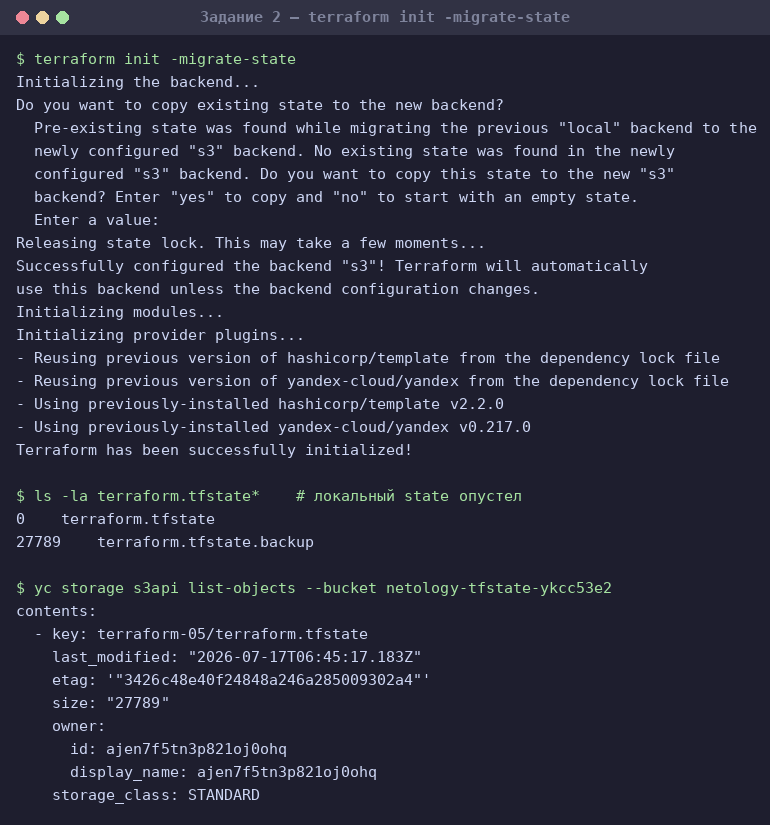

Локальный `terraform.tfstate` обнулился (27 789 байт уехали в `terraform.tfstate.backup`),
а в бакете появился объект `terraform-05/terraform.tfstate` того же размера. Владелец
объекта — `ajen7f5tn3p821oj0ohq`, то есть сервисный аккаунт `tfstate-editor`: backend
действительно работает под аккаунтом с `storage.editor`, а не под админским.

### Блокировка сработала

В одном окне открыт `terraform console`, в другом из той же директории запущен `terraform apply`:

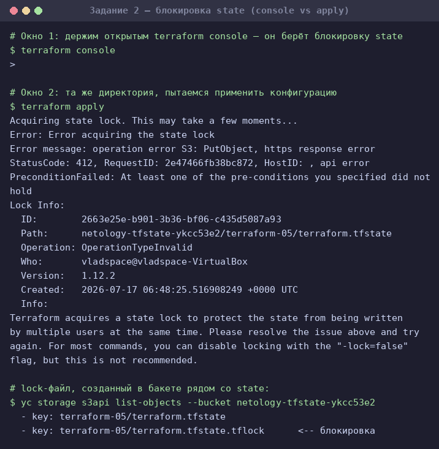

```
Error: Error acquiring the state lock

Error message: operation error S3: PutObject, https response error StatusCode: 412,
RequestID: 2e47466fb38bc872, api error PreconditionFailed: At least one of the
pre-conditions you specified did not hold
Lock Info:
  ID:        2663e25e-b901-3b36-bf06-c435d5087a93
  Path:      netology-tfstate-ykcc53e2/terraform-05/terraform.tfstate
  Operation: OperationTypeInvalid
  Who:       vladspace@vladspace-VirtualBox
  Version:   1.12.2
  Created:   2026-07-17 06:48:25.516908249 +0000 UTC
```

Что здесь происходит по шагам:

1. `terraform console` при открытии берёт блокировку state — она нужна не только на запись:
   пока идёт сессия, никто не должен подменить состояние под ногами.
2. Блокировка — это объект в том же бакете рядом со state:
   `terraform-05/terraform.tfstate.tflock` (256 байт).
3. Второй Terraform пытается создать этот же объект **условной записью** (`If-None-Match`),
   Object Storage отвечает **412 PreconditionFailed** — «объект уже есть». Это и есть весь
   механизм `use_lockfile`: атомарность обеспечивает сам S3, отдельная БД для блокировок не нужна.

> **Замечание к тексту задания.** В задании сказано, что lock-файл называется
> `<key>.lock.info`. Фактически Terraform 1.12.2 создаёт **`<key>.tflock`** — это видно
> в листинге бакета выше. Имя `.lock.info` использует backend `local` (`.terraform.tfstate.lock.info`).

### force-unlock

При штатном выходе из консоли Terraform сам пишет `Releasing state lock` и удаляет объект
блокировки — тогда `force-unlock` не нужен. Он нужен, когда процесс умер аварийно и убрать
за собой не успел, поэтому для демонстрации `terraform console` был убит по `kill -9`:
lock-файл остался в бакете, и любая следующая команда упиралась в него.

```
$ terraform force-unlock 2663e25e-b901-3b36-bf06-c435d5087a93
Do you really want to force-unlock?
  Terraform will remove the lock on the remote state.
  Only 'yes' will be accepted to confirm.

  Enter a value: yes

Terraform state has been successfully unlocked!
```

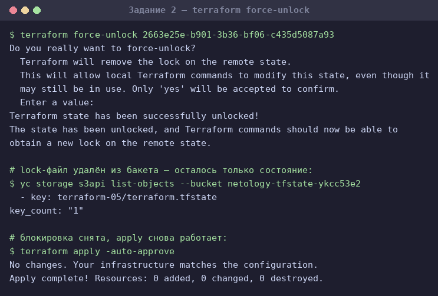

После разблокировки объект `.tflock` из бакета исчез, а `terraform apply` снова отработал
(`No changes. Your infrastructure matches the configuration.`).

---

## Задание 3 — ветка terraform-hotfix и pull request

Ветка [`terraform-hotfix`](https://github.com/vpakspace/terraform-yc-hw/tree/terraform-hotfix)
создана из `terraform-05`. Линтеры прогнаны уже по **собственному** коду (каталог `05/task1`
не в счёт — там лежит чужой код, объект задания 1) и нашли **12 замечаний**, все исправлены:

| Инструмент | Замечание | Где | Как исправлено |
|---|---|---|---|
| tflint | `terraform_module_pinned_source` × 2 | `src/main.tf` | `?ref=main` → `?ref=4d05fab8…` — коммит-хеш тега 1.0.0 |
| tflint | `terraform_required_providers` | `src/providers.tf` | провайдеру `yandex` задан `version = "~> 0.217"` |
| tflint | `terraform_unused_declarations` × 4 | `validation/variables.tf` | переменные выведены в [`validation/outputs.tf`](validation/outputs.tf) |
| checkov | `CKV_TF_1`, `CKV_TF_2` × 2 модуля | `src/main.tf` | тот же коммит-хеш закрывает оба правила |
| checkov | `CKV_YC_3` | `backend-infra/main.tf` | бакет со state шифруется ключом KMS |

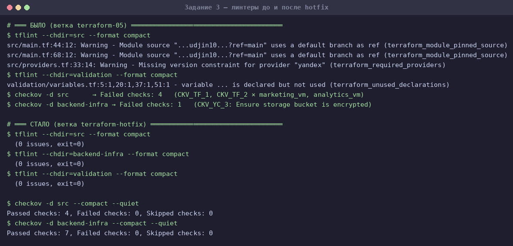

**Почему хеш, а не тег.** Правила спорят между собой: `CKV_TF_2` требует тег с номером версии,
а `CKV_TF_1` — коммит-хеш. Проверка показала, что хеш устраивает оба (тег `1.0.0` оставляет
`CKV_TF_1` красным, а хеш даёт `Passed checks: 2, Failed checks: 0`). Это логично: тег можно
передвинуть на другой коммит, хеш — нельзя, поэтому неизменяемая ссылка строго сильнее.
Взят хеш коммита, на который указывает тег `1.0.0`, а сам тег назван в комментарии рядом.

**Почему KMS.** `CKV_YC_3` требует шифровать бакет, и для state это по делу: он хранит слепок
всей инфраструктуры вместе с чувствительными значениями. Добавлен `yandex_kms_symmetric_key`,
а обоим сервисным аккаунтам выдана роль `kms.keys.encrypterDecrypter` — без неё backend не
смог бы писать в зашифрованный бакет.

**Результат** — оба линтера чисты:

```
$ tflint --chdir=src|backend-infra|validation --format compact     # 0 issues, exit=0
$ checkov -d src            → Passed checks: 4, Failed checks: 0
$ checkov -d backend-infra  → Passed checks: 7, Failed checks: 0
```

**План изменений инфраструктуры.** Правки не косметические, `terraform plan` это показывает:

```
# 05/src
  ~ module.marketing_vm.yandex_compute_instance.vm[0]
  ~ module.analytics_vm.yandex_compute_instance.vm[0]
      ~ description = "TODO: description; {{terraform yyy managed}}"
                   -> "TODO: description; {{terraform managed}}"
Plan: 0 to add, 2 to change, 0 to destroy.

# 05/backend-infra
  + yandex_kms_symmetric_key.tfstate
  + yandex_kms_symmetric_key_iam_member.bucket_admin
  + yandex_kms_symmetric_key_iam_member.tfstate
  ~ yandex_storage_bucket.tfstate
      + sse_algorithm = "aws:kms"
Plan: 3 to add, 1 to change, 0 to destroy.
```

Разница в `description` — наглядная иллюстрация к самому замечанию: пока код ссылался на ветку
`main`, её автор успел поменять модуль, и та же конфигурация стала разворачивать другую ВМ.
Именно от этого и защищает закрепление версии.

**Pull request: [#1 — fix: устранены все замечания tflint и checkov](https://github.com/vpakspace/terraform-yc-hw/pull/1)**
(`terraform-hotfix` → `terraform-05`). Результаты анализа обоих линтеров и планы обеих
конфигураций — в [комментарии к PR](https://github.com/vpakspace/terraform-yc-hw/pull/1#issuecomment-5000074473).

Вливать его в `terraform-05` не требуется — по условию задания PR открыт для ревью.

---

## Задание 4 — валидация ip-адресов

Код: [`validation/variables.tf`](validation/variables.tf).

```hcl
variable "vm_ip" {
  type        = string
  description = "ip-адрес"
  default     = "192.168.0.1"

  validation {
    condition     = can(cidrhost("${var.vm_ip}/32", 0))
    error_message = "Переменная vm_ip должна содержать корректный IPv4-адрес, например 192.168.0.1."
  }
}

variable "vm_ip_list" {
  type        = list(string)
  description = "список ip-адресов"
  default     = ["192.168.0.1", "1.1.1.1", "127.0.0.1"]

  validation {
    condition     = alltrue([for ip in var.vm_ip_list : can(cidrhost("${ip}/32", 0))])
    error_message = "Каждый элемент vm_ip_list должен быть корректным IPv4-адресом."
  }
}
```

Как это работает: `cidrhost()` разбирает префикс и возвращает адрес хоста по номеру. Маска
`/32` — ровно один адрес, поэтому для корректного ip функция отрабатывает, а на мусоре вроде
`1920.1680.0.1` падает с ошибкой. `can()` перехватывает падение и превращает его в `false` —
на этом и строится проверка. Для списка тот же приём обёрнут в `alltrue([for ...])`: достаточно
одного битого адреса, чтобы валидация не прошла.

Тесты из `terraform console` — верные значения принимаются, неверные отбиваются:

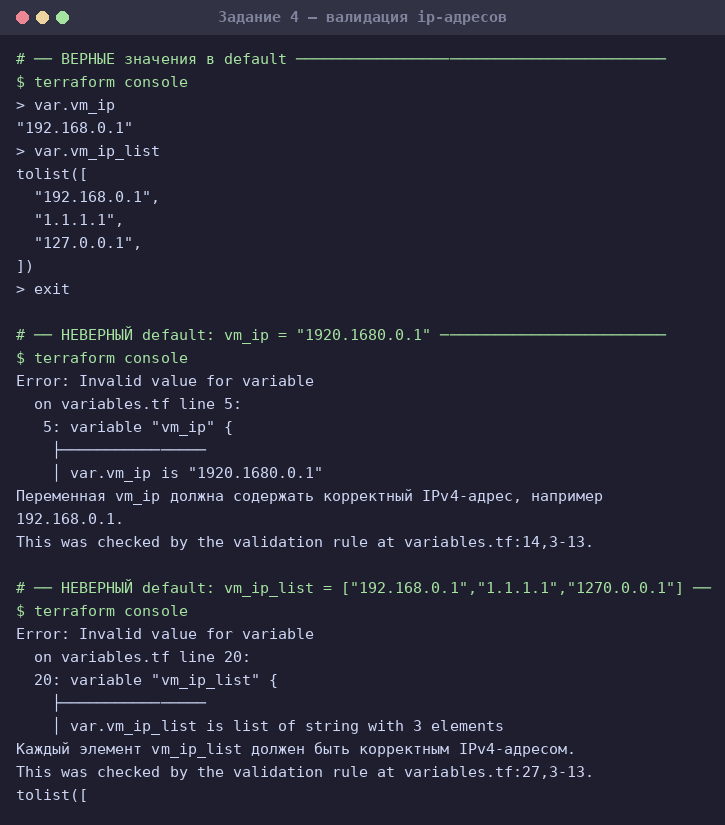

| Переменная | Значение | Результат |
|---|---|---|
| `vm_ip` | `"192.168.0.1"` | принято |
| `vm_ip` | `"1920.1680.0.1"` | `Invalid value for variable` |
| `vm_ip_list` | `["192.168.0.1", "1.1.1.1", "127.0.0.1"]` | принято |
| `vm_ip_list` | `["192.168.0.1", "1.1.1.1", "1270.0.0.1"]` | `Invalid value for variable` |

---

## Задание 5* — валидация строки и объекта

Код: [`validation/variables.tf`](validation/variables.tf).

```hcl
variable "any_string" {
  type        = string
  description = "любая строка"
  default     = "netology terraform"

  validation {
    condition     = var.any_string == lower(var.any_string)
    error_message = "Строка any_string не должна содержать символов верхнего регистра."
  }
}

variable "in_the_end_there_can_be_only_one" {
  description = "Who is better Connor or Duncan?"
  type = object({
    Dunkan = optional(bool)
    Connor = optional(bool)
  })

  default = {
    Dunkan = true
    Connor = false
  }

  validation {
    error_message = "There can be only one MacLeod"
    condition = (
      var.in_the_end_there_can_be_only_one.Dunkan != null &&
      var.in_the_end_there_can_be_only_one.Connor != null &&
      var.in_the_end_there_can_be_only_one.Dunkan != var.in_the_end_there_can_be_only_one.Connor
    )
  }
}
```

**Строка без верхнего регистра.** Сравнение `var.any_string == lower(var.any_string)` надёжнее
регулярки вида `^[^A-Z]*$`: оно ловит верхний регистр не только в латинице, но и в кириллице
и любом другом юникоде.

**Горец.** Требуется «одно true, второе false», то есть исключающее ИЛИ — `Dunkan != Connor`.
Но `optional(bool)` без значения по умолчанию даёт `null`, поэтому одного XOR мало: пара
`{Dunkan = true}` без Connor проскочила бы (`true != null` — истина), хотя второго горца не
объявили вовсе. Отсюда две явные проверки на `null` перед сравнением.

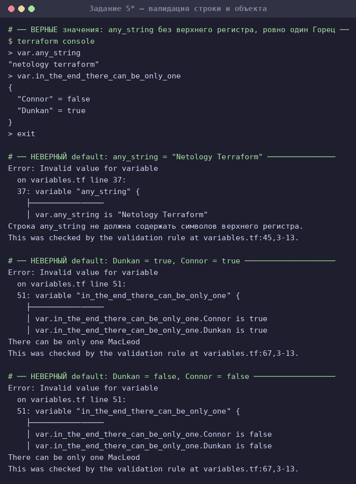

| Переменная | Значение | Результат |
|---|---|---|
| `any_string` | `"netology terraform"` | принято |
| `any_string` | `"Netology Terraform"` | `Invalid value for variable` |
| `in_the_end_there_can_be_only_one` | `{Dunkan = true, Connor = false}` | принято |
| `in_the_end_there_can_be_only_one` | `{Dunkan = true, Connor = true}` | `There can be only one MacLeod` |
| `in_the_end_there_can_be_only_one` | `{Dunkan = false, Connor = false}` | `There can be only one MacLeod` |
| `in_the_end_there_can_be_only_one` | `{Dunkan = true}` (Connor не задан) | `There can be only one MacLeod` |

---

## Задание 6* — CI/CD в GitHub Actions

Пайплайн: [`.github/workflows/terraform-05.yml`](../.github/workflows/terraform-05.yml).
Взят за образец [`05/gitlab-ci.yml`](https://github.com/netology-code/ter-homeworks/blob/main/05/gitlab-ci.yml)
из демо: сначала этап линтеров с сохранением отчётов в артефакты, затем этап работы с инфраструктурой.

```yaml
on:
  workflow_dispatch:
    inputs:
      action:                       # plan | apply | destroy
        type: choice
jobs:
  lint:                             # tflint + checkov → артефакты для code review
  terraform:
    needs: lint
    steps:
      - uses: actions/checkout@v4   # «скачайте с её помощью ваш репозиторий»
      - run: terraform init -input=false
      - run: terraform plan  -input=false
      - run: terraform apply -auto-approve    # if: inputs.action == 'apply'
      - run: terraform destroy -auto-approve  # if: inputs.action == 'destroy'
```

Ключевые моменты:

- **Ни одного секрета в коде.** Реквизиты приходят из GitHub Secrets: `YC_SA_KEY` (ключ
  сервисного аккаунта — раннер кладёт его в файл и передаёт путь через `TF_VAR_sa_key_file`),
  `YC_CLOUD_ID`, `YC_FOLDER_ID`, `VM_PUBLIC_KEY`, а также `TFSTATE_ACCESS_KEY` /
  `TFSTATE_SECRET_KEY` для backend — те самые статические ключи из задания 7*.
  Локально их роль играют `personal.auto.tfvars` и `~/.aws/credentials`, которые в `.gitignore`.
- **Общий state.** Раннер работает с тем же backend в Object Storage, что и рабочая машина,
  поэтому CI видит актуальное состояние, а встроенные блокировки не дают выполнить два apply
  одновременно — ровно та проблема, ради которой remote state и заводят в команде.
- **`terraform_wrapper: false`** у `setup-terraform`: обёртка подменяет вывод команд своим,
  и логи `apply`/`destroy` становятся нечитаемыми.

### Прогоны

Запуск: `gh workflow run terraform-05.yml --ref terraform-05 -f action=<plan|apply|destroy>`
(или кнопкой Run workflow в интерфейсе). Файл workflow продублирован в ветку `main`, потому что
GitHub регистрирует `workflow_dispatch` только из ветки по умолчанию; сам прогон при этом идёт
по коду и состоянию ветки `terraform-05`.

Полный цикл — инфраструктура развёрнута и уничтожена **средствами CI**:

| Прогон | Действие | Результат |
|---|---|---|
| [29562714024](https://github.com/vpakspace/terraform-yc-hw/actions/runs/29562714024) | `apply` | `No changes` — раннер подхватил state, созданный локально |
| [29562853573](https://github.com/vpakspace/terraform-yc-hw/actions/runs/29562853573) | `destroy` | `Destroy complete! Resources: 8 destroyed` |
| [29562986235](https://github.com/vpakspace/terraform-yc-hw/actions/runs/29562986235) | `apply` | `Apply complete! Resources: 8 added` |
| [29563140262](https://github.com/vpakspace/terraform-yc-hw/actions/runs/29563140262) | `destroy` | `Destroy complete! Resources: 8 destroyed` — финальная очистка |

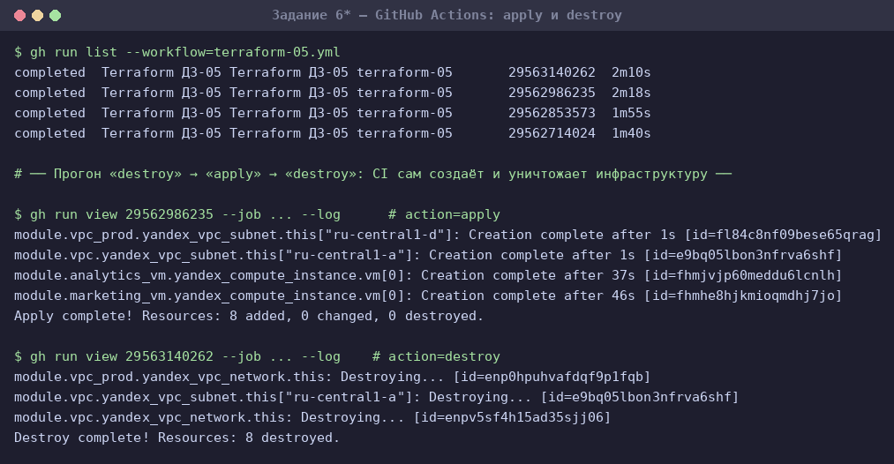

Самое показательное — первый прогон. Раннер — чужая машина, которая никогда не видела эту
инфраструктуру, но после `terraform init` он ответил `No changes. Your infrastructure matches
the configuration.`, потому что состояние лежит в общем бакете. Ровно ради этого remote state
в команде и заводят: локальный `terraform.tfstate` на ноутбуке одного человека такого не позволяет.

Линтеры в прогонах отработали на коде ветки `terraform-05` и честно показали те самые
замечания из задания 3 (они исправлены в `terraform-hotfix`, который по условию не вливается):

```
! Missing version constraint for provider "yandex" in `required_providers`
! Module source "git::…udjin10/yandex_compute_instance.git?ref=main" uses a default branch as ref (main)
```

---

## Задание 7* — отдельный root-модуль для remote state

Код: [`backend-infra/`](backend-infra). Это bootstrap-модуль: он создаёт то, в чём потом
хранится состояние основного проекта. Его собственный state остаётся локальным — положить
его в бакет, которого ещё нет, нельзя.

Что создаётся (`Apply complete! Resources: 9 added`):

| Ресурс | Назначение |
|---|---|
| `yandex_storage_bucket.tfstate` | Бакет `netology-tfstate-ykcc53e2` под tfstate, `versioning enabled`, лимит 1 ГБ |
| `yandex_iam_service_account.tfstate` + роль `storage.editor` + статический ключ | Рабочий аккаунт: под ним ходит backend |
| `yandex_iam_service_account.bucket_admin` + роль `storage.admin` + статический ключ | Создаёт и настраивает бакет |
| `time_sleep.wait_for_iam` | Пауза 15 с на распространение выданных ролей |
| `random_string.unique_id` | Суффикс имени: имена бакетов уникальны глобально |

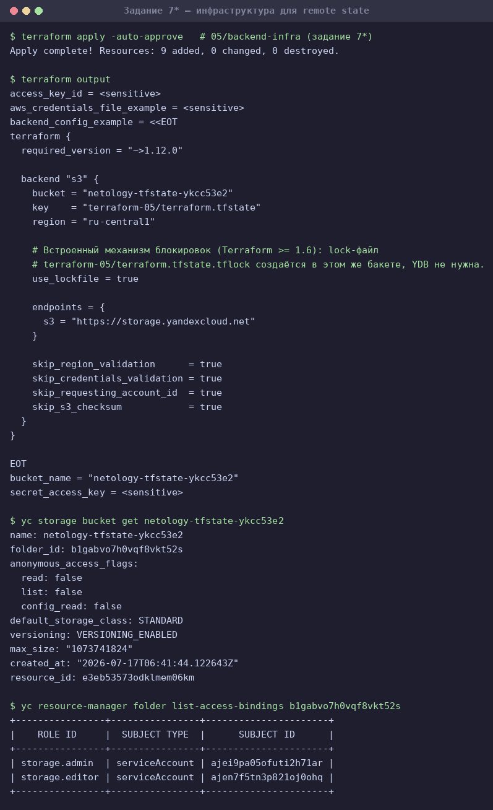

**Почему аккаунта два.** Задание требует для backend роль `storage.editor`, и её действительно
достаточно для работы: state и lock-файл — это обычные объекты, нужны Get/Put/Delete.
Но включить версионирование этим аккаунтом нельзя: `PutBucketVersioning` — операция над самим
бакетом, она требует `storage.admin`. Проверено практикой — с одним лишь `storage.editor`
apply падает:

```
Error: handling versioning: error putting S3 versioning: AccessDenied
       status code: 403
```

Выдавать рабочему аккаунту админские права ради разовой настройки — значит расширить их
навсегда, поэтому бакет создаёт отдельный `tfstate-admin`, а наружу отдаётся ключ
`tfstate-editor` с минимально необходимой ролью.

**Ещё две особенности**, вылезшие при отладке:

- Роли выдаются асинхронно. Без `time_sleep` бакет не создавался: ключ уже существует,
  а права ещё не разъехались — S3 отвечает `AccessDenied`.
- Сам сервисный аккаунт `terraform`, под которым работает провайдер, имел роль `editor`,
  а её недостаточно, чтобы назначать роли другим (`updateAccessBindings`). Это чистый
  bootstrap: одноразово выдано через CLI от владельца облака —
  `yc resource-manager folder add-access-binding <folder> --role admin --service-account-id <id>`.

**Версионирование не для галочки.** Бакет хранит историю, и она хорошо показывает, что
происходило со state за время работы (`list_object_versions` через S3 API):

```
Версий: 21 | delete-маркеров: 13 | всего: 34
  версий tfstate: 8      (актуальная — 1067 Б: пустой state после финального destroy)
  версий tflock: 13, delete-маркеров tflock: 13
```

Читается это так:

- **8 версий `terraform.tfstate`** — снимок после каждой записи. Любую можно поднять, если
  состояние испортят: ровно то, ради чего задание требует версионирование.
- **13 версий `.tflock` и ровно 13 delete-маркеров** — 13 циклов «взял блокировку → отдал».
  Симметрия означает, что ни одна блокировка не осталась висеть, включая ту, что снималась
  вручную через `force-unlock`.

Тот же эффект виден в консоли: `yc storage s3api list-objects` показывает **1** актуальный
объект, а консоль — **10 объектов и 55.6 КБ** (на момент снимка), потому что считает версии.

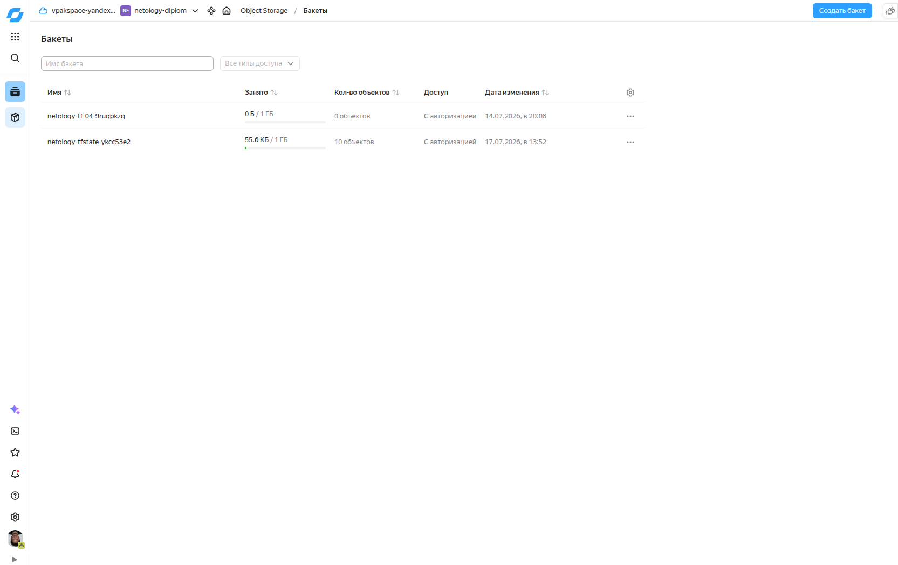

**Outputs** (`outputs.tf`): имя бакета, `access_key_id` и `secret_access_key` (оба `sensitive`),
готовый блок `backend` для копирования и содержимое `~/.aws/credentials`. Секреты в
`backend_config_example` намеренно не подставляются — этот блок идёт в репозиторий.

Именно этими outputs и настроен backend основного проекта (п. 3 задания):

```bash
cd 05/backend-infra
terraform output -raw aws_credentials_file_example > ~/.aws/credentials
terraform output backend_config_example        # → вставлено в 05/src/providers.tf
```

---

## Очистка

Все созданные ресурсы удалены, облако вернулось к состоянию до начала работы.

| Что | Чем удалено |
|---|---|
| Инфраструктура `05/src` — 2 ВМ, 2 сети, 4 подсети | `destroy` **средствами CI** (задание 6*): `Destroy complete! Resources: 8 destroyed` |
| Бакет `netology-tf-04-9ruqpkzq`, оставшийся от ДЗ-4 | `terraform destroy` в `04/s3` |
| Содержимое бакета со state — 34 версии и delete-маркера | S3 API: версионированный бакет не удаляется, пока в нём есть хоть одна версия |
| Бакет `netology-tfstate-ykcc53e2`, 2 сервисных аккаунта, статические ключи, ключ KMS | `terraform destroy` в `05/backend-infra`: `Destroy complete! Resources: 9 destroyed` |
| Роль `admin`, выданная SA `terraform` для bootstrap | `yc resource-manager folder remove-access-binding … --role admin` — права вернулись к исходному `editor` |

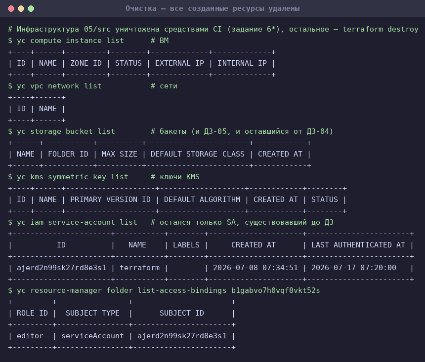

Осталcя только сервисный аккаунт `terraform`, существовавший до этого ДЗ, — с той же ролью
`editor`, что и была. Ключи `TFSTATE_ACCESS_KEY` / `TFSTATE_SECRET_KEY` в GitHub Secrets стали
недействительными вместе с удалёнными сервисными аккаунтами; для повторного прогона нужно
заново применить `05/backend-infra` и обновить секреты его новыми outputs.
