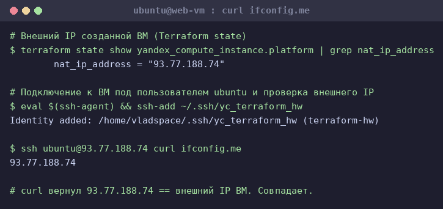
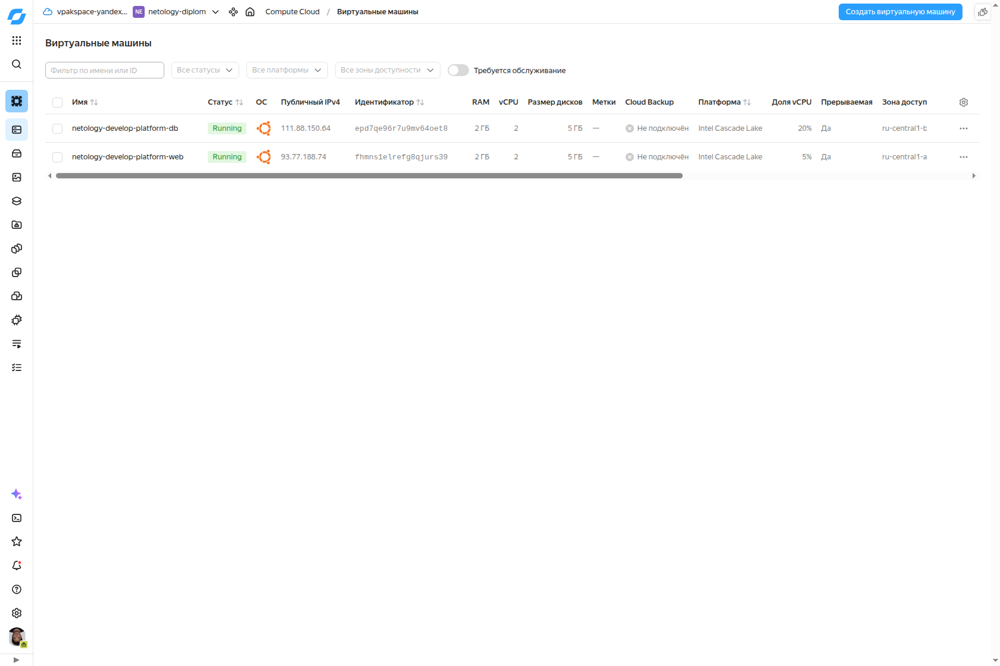
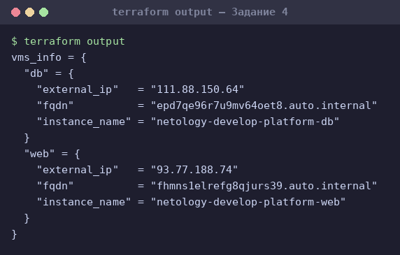
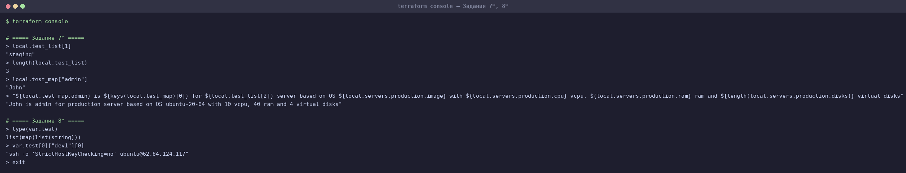
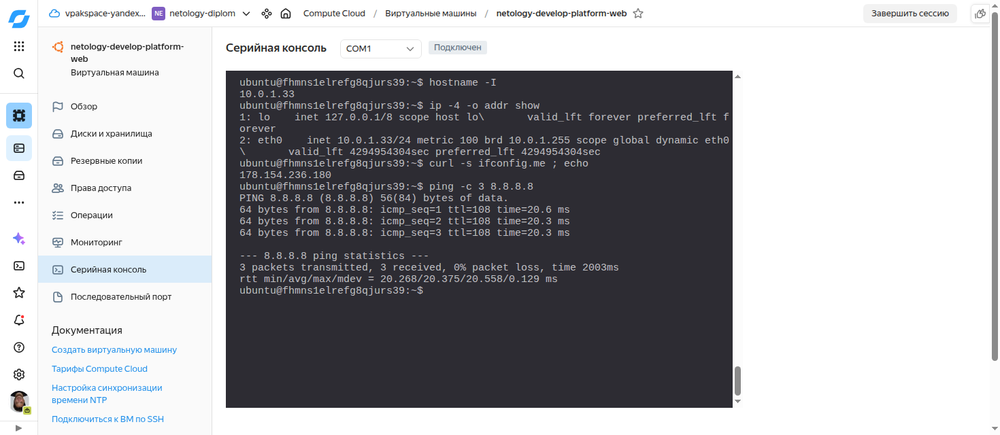

# Домашнее задание «Основы Terraform. Yandex Cloud»

Учебный проект курса «DevOps‑инженер» (Нетология). «Готовый код» взят из официального
репозитория [`netology-code/ter-homeworks`](https://github.com/netology-code/ter-homeworks),
директория [`02/src`](02/src). Здесь — итоговый (исправленный и доработанный по заданиям) код
и разбор.

**Цели задания:**

1. Создать свои ресурсы в облаке Yandex Cloud с помощью Terraform.
2. Освоить работу с переменными Terraform.

## Окружение выполнения

| Компонент | Версия |
|-----------|--------|
| ОС | Ubuntu 24.04 (Oracle VirtualBox VM) |
| Terraform | **1.12.2** (удовлетворяет `required_version = "~>1.12.0"`) |
| Yandex Cloud CLI | 1.6.0 |
| Провайдер | `yandex-cloud/yandex` v0.213.0 (через зеркало) |
| Cloud / Folder | `vpakspace-yandexcloud` / `netology-diplom` |

> `~>1.12.0` — оператор pessimistic constraint на patch‑уровне, что означает диапазон
> **`>= 1.12.0, < 1.13.0`** (только линейка 1.12.x). Поэтому стоит последняя версия из линейки — 1.12.2.

---

## Подготовка (Задание 1, п. 1–4)

### Сервисный аккаунт и ключ

Провайдер в [`providers.tf`](02/src/providers.tf) аутентифицируется по ключу сервисного аккаунта:
`service_account_key_file = file("~/.authorized_key.json")`. Поэтому создан SA и авторизованный ключ:

```bash
# сервисный аккаунт
yc iam service-account create --name terraform --folder-id <folder_id>
# роль editor на каталог (достаточно для VPC + Compute + NAT)
yc resource-manager folder add-access-binding <folder_id> \
  --role editor --subject serviceAccount:<sa_id>
# авторизованный ключ ровно туда, где его ждёт провайдер
yc iam key create --service-account-id <sa_id> --output ~/.authorized_key.json
chmod 600 ~/.authorized_key.json
```

### SSH‑ключ

Сгенерирован ed25519‑ключ `~/.ssh/yc_terraform_hw`, его **публичная** часть кладётся в ВМ
через `metadata.ssh-keys` (пользователь `ubuntu`).

### Секреты и зеркало провайдера

- `cloud_id`, `folder_id`, ssh‑ключ вынесены в **`personal.auto.tfvars`** — файл в `.gitignore`,
  в репозиторий не попадает (Terraform автоматически подхватывает `*.auto.tfvars`).
- Ключ SA (`~/.authorized_key.json`) лежит вне репозитория, в `$HOME`.
- [`.terraformrc`](02/src/.terraformrc) настраивает **зеркало провайдеров Yandex Cloud**
  (`terraform-mirror.yandexcloud.net`) — прямой доступ к `registry.terraform.io` из РФ часто заблокирован.
  Перед командами: `export TF_CLI_CONFIG_FILE="$PWD/.terraformrc"`.

---

## Задание 0. Security groups

Изучена [документация к security‑groups Yandex Cloud](https://cloud.yandex.ru/docs/vpc/concepts/security-groups).
Коротко: **security group** — это виртуальный firewall уровня облачной сети. Правила описывают
разрешённый трафик по направлению (`ingress`/`egress`), протоколу (tcp/udp/icmp/any), портам и
источнику/назначению (CIDR, другая SG, `self`, либо предопределённые цели вроде
`loadbalancer_healthchecks`). SG навешивается на `network_interface` ВМ или на target‑group
балансировщика. По умолчанию, если к интерфейсу привязана хотя бы одна SG, весь неописанный трафик
запрещается — поэтому обычно явно открывают SSH (22), нужные сервисные порты и egress `0.0.0.0/0`.
Функционал понадобится на следующей лекции.

---

## Задание 1. Первая ВМ, исправление ошибок, проверка

### Намеренная ошибка (посимвольно) и её разбор

В `main.tf` было `platform_id = "standart-v4"`. Это **value‑ошибка**: HCL‑синтаксис корректен,
поэтому `terraform validate` её **не ловит** — проблема всплывает только на `apply`, когда
Yandex Cloud API отвергает значение. Исправление потребовало трёх шагов: одна опечатка потянула
за собой цепочку ограничений платформ YC.

| # | Что стояло | Ошибка от YC API (на apply) | Суть | Исправление |
|---|-----------|-----------------------------|------|-------------|
| 1 | `platform_id = "standart-v4"` | `FailedPrecondition: Platform "standart-v4" not found` | Опечатка `standart`→`standard`, **и** платформы `v4` в YC не существует (есть v1/v2/v3). | пробуем `standard-v3` |
| 2 | `platform_id = "standard-v3"`, `core_fraction = 5` | `InvalidArgument: the specified core fraction is not available on platform "standard-v3"; allowed core fractions: 20, 50, 100` | Ice Lake (v3) **не поддерживает** `core_fraction=5`. А задание требует именно 5% — значит платформа должна быть та, что поддерживает 5% (Cascade Lake v2 / Broadwell v1). | пробуем `standard-v2` |
| 3 | `platform_id = "standard-v2"`, `cores = 1`, `core_fraction = 5` | `InvalidArgument: the specified number of cores is not available on platform "standard-v2"; allowed core number: 2, 4` | На текущих платформах YC для `core_fraction=5` минимум **2 ядра** (1 ядро с burstable‑долей больше не предлагается). | `cores = 2` |
| ✅ | `platform_id = "standard-v2"`, `cores = 2`, `memory = 2`, `core_fraction = 5` | — | Валидная конфигурация: сохранён `core_fraction=5` (акцент задания 1.8), платформа поддерживает 5% при 2 ядрах. | apply успешен |

Итог: **суть намеренной ошибки — опечатка в `platform_id`** (`standart`→`standard`); по ходу
исправления пришлось привести конфигурацию в соответствие с актуальными ограничениями платформ
YC (5%‑доля vCPU доступна на `standard-v1/v2` и только от 2 ядер).

### Создание и проверка

`terraform init` (провайдер `yandex-cloud/yandex v0.213.0` через зеркало) → `terraform apply`.
Создана ВМ `netology-develop-platform-web` (zone `ru-central1-a`), внешний IP **93.77.188.74**.

Подключение по SSH и проверка внешнего адреса — `curl` возвращает **тот же** внешний IP:



ВМ в личном кабинете Yandex Cloud с видимым внешним IP (здесь уже обе ВМ — web из Задания 1 и db
из Задания 3; web‑ВМ — нижняя, `93.77.188.74`, зона `ru-central1-a`):



### Ответ: чем полезны `preemptible = true` и `core_fraction = 5` в обучении

- **`preemptible = true`** (прерываемая ВМ). YC вправе остановить такую ВМ в любой момент и
  гарантированно останавливает не позже чем через **24 часа**, зато стоит она примерно **в 2–3 раза
  дешевле** обычной. Для учёбы это идеально: ВМ нужна на короткие сессии, «пять девяток» доступности
  не требуются, а экономия гранта существенная. Бонус — автоостановка через 24 ч страхует от
  «забыл выключить и слил грант».
- **`core_fraction = 5`** — гарантированная доля vCPU 5% («burstable» инстанс). Платишь за базовые
  5% производительности ядра (с возможностью кратких всплесков выше), а не за полное ядро. Учебная
  ВМ почти всё время простаивает, нагрузка — редкие короткие команды, поэтому 5% более чем хватает,
  а цена минимальна.

Вместе `preemptible + core_fraction=5` дают **самую дешёвую** конфигурацию — оптимально для
экспериментов и домашних заданий.

---

## Задание 2. Хардкод → переменные `vm_web_`

Все хардкод‑значения ресурсов `yandex_compute_image` и `yandex_compute_instance` вынесены в
отдельные переменные с префиксом **`vm_web_`** (с указанием `type` и `default` = прежнее значение):
`vm_web_image_family`, `vm_web_name`, `vm_web_zone`, `vm_web_platform_id`, `vm_web_cores`,
`vm_web_memory`, `vm_web_core_fraction`, `vm_web_nat`, `vm_web_preemptible`.

`terraform plan` после рефакторинга:

```
No changes. Your infrastructure matches the configuration.
```

Изменений нет — значит значения переменных в точности повторяют прежний хардкод. ✔

---

## Задание 3. Вторая ВМ (`db`) в зоне `ru-central1-b`

- Создан файл [`vms_platform.tf`](02/src/vms_platform.tf), в него **перенесены все переменные
  первой (web) ВМ** и объявлены переменные второй ВМ с префиксом **`vm_db_`**.
- В [`main.tf`](02/src/main.tf) скопирован блок ресурса → вторая ВМ `netology-develop-platform-db`
  (`cores = 2`, `memory = 2`, `core_fraction = 20`), зона **`ru-central1-b`**.
- Так как ВМ должна жить в зоне B, добавлена **отдельная подсеть `develop-b`** в `ru-central1-b`
  (`10.0.2.0/24`) — ВМ обязана находиться в подсети своей зоны (по образцу демо лекции).

`terraform apply` → `2 added` (подсеть zone B + db‑ВМ). Обе ВМ видны в консоли (скриншот выше):
db — `111.88.150.64`, `ru-central1-b`, доля vCPU 20%.

---

## Задание 4. `outputs.tf` — один output для обеих ВМ

В [`outputs.tf`](02/src/outputs.tf) один output `vms_info`, содержащий `instance_name`,
`external_ip`, `fqdn` для каждой ВМ (значения из атрибутов ресурсов, без хардкода):



```hcl
vms_info = {
  "db"  = { external_ip = "111.88.150.64", fqdn = "epd7qe96r7u9mv64oet8.auto.internal", instance_name = "netology-develop-platform-db"  }
  "web" = { external_ip = "93.77.188.74",  fqdn = "fhmns1elrefg8qjurs39.auto.internal", instance_name = "netology-develop-platform-web" }
}
```

---

## Задание 5. `locals.tf` — имена ВМ через интерполяцию

В [`locals.tf`](02/src/locals.tf) в одном `locals`‑блоке имя каждой ВМ собирается интерполяцией
`${..}` из **нескольких** переменных:

```hcl
locals {
  vm_web_name = "${var.project}-${var.vpc_name}-platform-${var.vm_web_role}"
  vm_db_name  = "${var.project}-${var.vpc_name}-platform-${var.vm_db_role}"
}
```

`project="netology"`, `vpc_name="develop"`, `vm_web_role="web"`, `vm_db_role="db"` →
`netology-develop-platform-web` / `netology-develop-platform-db`. В ресурсах `name` заменён на
`local.vm_web_name` / `local.vm_db_name`. Так как итоговые имена совпадают с прежними,
`terraform plan` → **No changes**. ✔

---

## Задание 6. `vms_resources` map(object) + общий `vms_metadata`

- Три переменные `.._cores` / `.._memory` / `.._core_fraction` заменены одной map‑переменной
  **`vms_resources`** с вложенным `map(object)` для обеих ВМ:

  ```hcl
  variable "vms_resources" {
    type = map(object({ cores = number, memory = number, core_fraction = number }))
    default = {
      web = { cores = 2, memory = 2, core_fraction = 5 }
      db  = { cores = 2, memory = 2, core_fraction = 20 }
    }
  }
  ```
  В ресурсах: `cores = var.vms_resources["web"].cores` и т.д.

- Отдельная **общая для всех ВМ** map‑переменная **`vms_metadata`** (`serial-port-enable` + `ssh-keys`),
  значение задаётся в `personal.auto.tfvars`. В ресурсах: `metadata = var.vms_metadata`.

- **Закомментированы** все более не используемые переменные: `vm_web_cores/memory/core_fraction`,
  `vm_db_cores/memory/core_fraction` (заменены на `vms_resources`), `vm_web_name` / `vm_db_name`
  (заменены на `locals`), `vms_ssh_root_key` (заменена на `vms_metadata`).

`terraform plan` → **No changes**. ✔

---

## Задание 7*. terraform console

Файл [`console.tf`](02/src/console.tf) содержит `local.test_list`, `local.test_map`, `local.servers`.



| Вопрос | Команда | Вывод |
|--------|---------|-------|
| Второй элемент `test_list` | `local.test_list[1]` | `"staging"` |
| Длина `test_list` | `length(local.test_list)` | `3` |
| Значение ключа `admin` | `local.test_map["admin"]` | `"John"` |
| Собрать строку | см. ниже | `"John is admin for production server based on OS ubuntu-20-04 with 10 vcpu, 40 ram and 4 virtual disks"` |

Interpolation‑выражение для последнего пункта (ключ «admin» вычленён через `keys()`):

```hcl
"${local.test_map.admin} is ${keys(local.test_map)[0]} for ${local.test_list[2]} server based on OS ${local.servers.production.image} with ${local.servers.production.cpu} vcpu, ${local.servers.production.ram} ram and ${length(local.servers.production.disks)} virtual disks"
```

---

## Задание 8*. Переменная `test` и её тип

В [`console.tf`](02/src/console.tf) объявлена переменная `test` со значением из задания. Полный тип
(проверен `type(var.test)` в консоли):

```hcl
variable "test" {
  type = list(map(list(string)))
  default = [ { "dev1" = [...] }, { "dev2" = [...] }, { "prod1" = [...] } ]
}
```

`type(var.test)` → `list(map(list(string)))` (список из map'ов «строка → список строк»).

Выражение для вычленения нужной строки:

```
> var.test[0]["dev1"][0]
"ssh -o 'StrictHostKeyChecking=no' ubuntu@62.84.124.117"
```

---

## Задание 9*. NAT gateway и выход в интернет без внешнего IP

По [инструкции YC](https://cloud.yandex.ru/ru/docs/vpc/operations/create-nat-gateway#tf_1) в
[`nat.tf`](02/src/nat.tf) добавлены:

```hcl
resource "yandex_vpc_gateway" "nat" {
  name = "${var.vpc_name}-nat-gateway"
  shared_egress_gateway {}
}
resource "yandex_vpc_route_table" "nat" {
  name       = "${var.vpc_name}-nat-route"
  network_id = yandex_vpc_network.develop.id
  static_route {
    destination_prefix = "0.0.0.0/0"
    gateway_id         = yandex_vpc_gateway.nat.id
  }
}
```

Route table привязан к **обеим** подсетям (`route_table_id`), а у обеих ВМ выставлено **`nat = false`**
(смена nat требует остановки ВМ — добавлен `allow_stopping_for_update = true`, ВМ обновляются
**in‑place**, без пересоздания; диск и заданный пароль `ubuntu` сохраняются).

После apply у ВМ **нет** внешнего IP (проверено `yc compute instance get`):

```
web (fhmns1elrefg8qjurs39): status RUNNING, internal 10.0.1.33, external — НЕТ
db  (epd7qe96r7u9mv64oet8): status RUNNING, internal 10.0.2.15, external — НЕТ
```

Так как внешнего IP нет, доступ в интернет проверяется через **serial console** (предварительно
по SSH задан пароль пользователя: `sudo passwd ubuntu`). Вход `ubuntu` / пароль, затем на ВМ:

| Команда | Вывод | Что доказывает |
|---------|-------|----------------|
| `hostname -I` | `10.0.1.33` | у ВМ только внутренний IP |
| `ip -4 -o addr show` | `eth0 ... 10.0.1.33/24 scope global` | на интерфейсе нет публичного адреса |
| `curl -s ifconfig.me` | **`178.154.236.180`** | публичный egress‑IP NAT‑шлюза (диапазон Yandex) — это **не** адрес ВМ |
| `ping -c 3 8.8.8.8` | 3 received, **0% packet loss** | связность с интернетом есть |

Итог: ВМ выходит в интернет **через NAT gateway**, хотя внешнего IP у неё нет (`nat = false`):



---

## Структура репозитория

```
terraform-yc-hw/
├── README.md              # этот файл (разбор, ответы, скриншоты)
├── 02/
│   └── src/               # итоговый код проекта
│       ├── providers.tf       # terraform{}, provider yandex, SA-key
│       ├── variables.tf       # cloud/network/metadata переменные
│       ├── vms_platform.tf    # переменные ВМ (vm_web_/vm_db_, vms_resources), Задания 3/5/6
│       ├── main.tf            # network, subnets, data image, 2 ВМ
│       ├── nat.tf             # NAT gateway + route table (Задание 9)
│       ├── locals.tf          # имена ВМ (Задание 5)
│       ├── outputs.tf         # output vms_info (Задание 4)
│       ├── console.tf         # data для Заданий 7/8 + variable test
│       ├── .terraformrc       # зеркало провайдеров YC
│       └── .gitignore         # игнор .terraform, *.tfstate, personal.auto.tfvars
├── img/                   # скриншоты
└── render_term.py         # утилита рендера вывода терминала в PNG
```

> `personal.auto.tfvars` и `~/.authorized_key.json` в репозиторий **не** попадают (`.gitignore` / вне репо).

## Итоги

- ✅ Задания 1–6 выполнены: SA + ключ, исправление намеренной ошибки (разбор цепочки), две ВМ в
  разных зонах, output, locals, map‑переменные `vms_resources`/`vms_metadata`; `plan` без изменений
  там, где рефакторинг не должен менять инфраструктуру.
- ✅ Задания 7*–9* выполнены: выражения `terraform console`, тип переменной `test`, NAT gateway с
  проверкой интернета через serial console при `nat=false`.
- 🧹 Очистка одной командой — `terraform destroy` удаляет обе ВМ, обе подсети, сеть, NAT gateway
  и route table (в облаке не остаётся платных ресурсов). Проект `02/src` переиспользуется
  последующими занятиями модуля, поэтому инфраструктура удаляется по завершении модуля.
